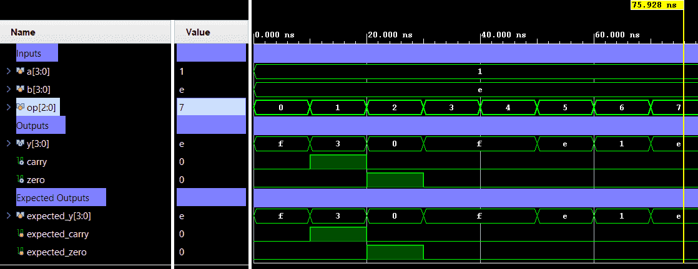

# ALU 4-bit


A parameterizable combinational ALU supporting arithmetic and logic operations selected by 3-bit opcode. Verification uses directed self-checking testbench.

## 📋 Specification / Architecture

| Parameter | Default | Description |
|-----------|---------|-------------|
| `WIDTH`     | 4       | Data width for `a`, `b`, and `y` |

### Architecture Description

A parameterizable ALU that computes operations based on a 3-bit `op` code. Arithmetic operations (`ADD`, `SUB`) generate a `carry` flag. Logical operations (`AND`, `OR`, `XOR`, `NOT_A`, `PASS_A`, `PASS_B`) bypass the carry logic. A `zero` flag indicates when the output `y` is zero.

### Architecture Diagram (ASCII)

```text
                 +-------------------+
        a ------>|                   |
        b ------>|     ALU 4-bit     |=====> y
       op ------>|                   |-----> carry
                 |                   |-----> zero
                 +-------------------+
```

## 🔌 Port List / Interface

| Signal | Direction | Width | Description |
|--------|-----------|-------|-------------|
| `a`      | Input     | `WIDTH` | Operand A |
| `b`      | Input     | `WIDTH` | Operand B |
| `op`     | Input     | 3     | Operation select |
| `y`      | Output    | `WIDTH` | ALU result |
| `carry`  | Output    | 1     | Carry/borrow flag for arithmetic ops |
| `zero`   | Output    | 1     | High when `y` is zero |

## Opcode Map

| op | Operation |
|----|-----------|
| 000 | ADD |
| 001 | SUB |
| 010 | AND |
| 011 | OR |
| 100 | XOR |
| 101 | NOT A |
| 110 | PASS A |
| 111 | PASS B |

## 🖥️ Simulation Results

Run simulation from either `sim/modelsim` or `sim/xsim` to view the waveform.



```text
=== ALU 4bit Testbench ===
               10000 | op=000 a=1 b=e | y=f c=0 z=0 | exp_y=f exp_c=0 exp_z=0 | PASS
               20000 | op=001 a=1 b=e | y=3 c=1 z=0 | exp_y=3 exp_c=1 exp_z=0 | PASS
               30000 | op=010 a=1 b=e | y=0 c=0 z=1 | exp_y=0 exp_c=0 exp_z=1 | PASS
               40000 | op=011 a=1 b=e | y=f c=0 z=0 | exp_y=f exp_c=0 exp_z=0 | PASS
               50000 | op=100 a=1 b=e | y=f c=0 z=0 | exp_y=f exp_c=0 exp_z=0 | PASS
               60000 | op=101 a=1 b=e | y=e c=0 z=0 | exp_y=e exp_c=0 exp_z=0 | PASS
               70000 | op=110 a=1 b=e | y=1 c=0 z=0 | exp_y=1 exp_c=0 exp_z=0 | PASS
               80000 | op=111 a=1 b=e | y=e c=0 z=0 | exp_y=e exp_c=0 exp_z=0 | PASS
=== PASS: all test vectors matched ===
```

## 🚀 How to Run

### Vivado xsim
```bash
cd sim/xsim && make sim

# Open waveform GUI view:
make gui

# Clean up simulation generated files:
make clean
```

### ModelSim / Questa
```bash
cd sim/modelsim && make sim

# Open waveform GUI view:
make gui

# Clean up simulation generated files:
make clean
```

### Portable Environment (Without Make)
```bash
# Vivado xsim
cd sim/xsim && xtclsh simulate.tcl

# ModelSim / Questa
cd sim/modelsim && vsim -c -do simulate.do
```

## ✅ Test Cases / Coverage

| Test | Input / Condition | Expected | Result |
|------|-------------------|----------|--------|
| `opcode_sweep` | All 8 opcodes with 16 directed input pairs each | Result matches reference model in TB | Pass |

## 🐛 Bugs Found

| Bug ID | Description | Fixed |
|--------|-------------|-------|
| None   | No bugs found in directed test | N/A |
