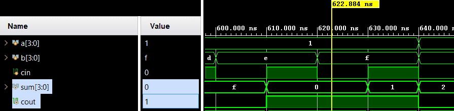

# Carry Lookahead Adder (CLA)


A parameterizable combinational carry-lookahead adder. It adds two `WIDTH`-bit operands and a carry-in to produce a `WIDTH`-bit sum and a carry-out. Verification utilizes a directed exhaustive self-checking testbench.

---

## 📋 Specification / Architecture

| Parameter | Default | Description |
|-----------|---------|-------------|
| `WIDTH`     | 4       | Data bus width of inputs `a`, `b`, and output `sum` |

### Architecture Description

**The Bottleneck of Ripple Carry Adder (RCA):** The carry signal must "ripple" through the circuit one bit at a time from LSB to MSB. The calculation of the next bit is delayed until the previous bit completes its carry calculation. This makes RCA impractically slow for large `WIDTH`.

**The CLA Solution:** CLA eliminates this ripple effect by calculating all carries simultaneously using two intermediate signals generated for each bit position:

| Signal | Formula | Function |
|----------|-----------|---------|
| **Propagate** `p[i]` | `a[i] ^ b[i]` | Indicates if the current bit will *propagate* a carry-in to the next stage |
| **Generate** `g[i]` | `a[i] & b[i]` | Indicates if the current bit will *generate* a carry-out independently |

By flattening the logic, the carry for any bit position can be evaluated directly:
```verilog
c[i+1] = g[i] | (p[i] & c[i])
```
*Note: The carry bit `c[i+1]` is either generated at the current stage (`g[i]`) OR a previous carry is propagated through the current stage (`p[i] & c[i]`).*

Finally, the sum is directly evaluated:
```verilog
sum[i] = p[i] ^ c[i]
```

### Architecture Diagram

```text
                  carry_lookahead_adder #(WIDTH)

           a[3] b[3]       a[2] b[2]       a[1] b[1]       a[0] b[0]
             | |             | |             | |             | |
           + v v +         + v v +         + v v +         + v v +
           | P/G |         | P/G |         | P/G |         | P/G |
           |  3  |         |  2  |         |  1  |         |  0  |
           +-----+         +-----+         +-----+         +-----+
              | (p3,g3)       | (p2,g2)       | (p1,g1)       | (p0,g0)
              |               |               |               |
              v               v               v               v
    +-------------------------------------------------------------------+
    |                   Lookahead Carry Unit (LCU)                      |
<---+ cout (c[4])                                                   cin +<---
    |                                                                   |
    +-------------------------------------------------------------------+
             |               |               |               |
             | c[3]          | c[2]          | c[1]          | c[0]
             v               v               v               v
           +---+           +---+           +---+           +---+
           |SUM|           |SUM|           |SUM|           |SUM|
           | 3 |           | 2 |           | 1 |           | 0 |
           +---+           +---+           +---+           +---+
             |               |               |               |
             v               v               v               v
           sum[3]          sum[2]          sum[1]          sum[0]

    * Note: SUM calculation implicitly uses P[i] (where sum[i] = p[i] ^ c[i])
```

## 🔌 Port List / Interface

| Signal | Direction | Width | Description |
|--------|-----------|-------|-------------|
| `a`      | Input     | WIDTH | Operand A |
| `b`      | Input     | WIDTH | Operand B |
| `cin`    | Input     | 1     | Carry input from previous stage |
| `sum`    | Output    | WIDTH | Calculated sum output |
| `cout`   | Output    | 1     | Carry output to next stage |

## 🖥️ Simulation Results

Run simulation from either `sim/modelsim` or `sim/xsim` to view the waveform.



```text
=== CARRY LOOKAHEAD ADDER Testbench ===
   time  |  a   b    cin | cout  sum | exp_cout exp_sum | result
---------------------------------------------------------------
   10000 | 0000 0000  0  | 0   0000 | 0        0000   | PASS
   20000 | 0000 0000  1  | 0   0001 | 0        0001   | PASS
   30000 | 0000 0001  0  | 0   0001 | 0        0001   | PASS
   ...
   ...
   ...
 5110000 | 1111 1111  0  | 1   1110 | 1        1110   | PASS
 5120000 | 1111 1111  1  | 1   1111 | 1        1111   | PASS
=== PASS: all 512 test vectors matched ===
```

## 🚀 How to Run

### Vivado xsim
```bash
cd sim/xsim && make sim

# Open waveform GUI view:
make gui

# Clean up simulation generated files:
make clean
```

### ModelSim / Questa
```bash
cd sim/modelsim && make sim

# Open waveform GUI view:
make gui

# Clean up simulation generated files:
make clean
```

### Portable Environment (Without Make)
```bash
# Vivado xsim
cd sim/xsim && xtclsh simulate.tcl

# ModelSim / Questa
cd sim/modelsim && vsim -c -do simulate.do
```

## ✅ Test Cases / Coverage

| Test | Input / Condition | Expected | Result |
|------|-------------------|----------|--------|
| `exhaustive_width4` | All `{a,b,cin}` combinations for WIDTH=4 (512 vectors) | `{cout,sum} = a + b + cin` | Pass |
| `corner_all_zero`   | `a=0`, `b=0`, `cin=0` | `sum=0`, `cout=0` | Pass |
| `corner_all_one`    | `a=1111`, `b=1111`, `cin=1` | `sum=1111`, `cout=1` | Pass |

## 🐛 Bugs Found

| Bug ID | Description | Fixed |
|--------|-------------|-------|
| None   | No bugs found in directed test | N/A |
