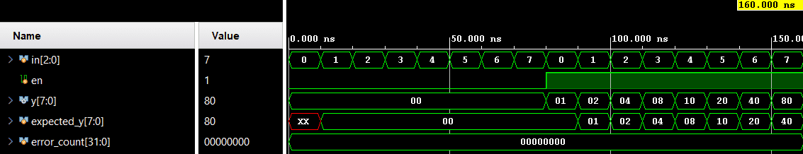

# Decoder 3-to-8


A combinational 3-to-8 decoder with active-high enable input. Verification uses directed self-checking testbench.

## 📋 Specification / Architecture

| Parameter | Default | Description |
|-----------|---------|-------------|
| N/A       | N/A     | Fixed decoder 3-to-8 |

### Architecture Description

The combinational decoder uses the 3-bit `in` signal to assert exactly one of the 8 bits of the one-hot output `y` when the `en` (enable) is high. If `en` is low, all bits of `y` are driven to zero.

### Architecture Diagram (ASCII)

```text
                 +-------------------+
       in ------>|                   |
                 |  Decoder 3-to-8   |=====> y (8-bit)
       en ------>|                   |
                 +-------------------+
```

## 🔌 Port List / Interface

| Signal | Direction | Width | Description |
|--------|-----------|-------|-------------|
| `in`     | Input     | 3     | Select input |
| `en`     | Input     | 1     | Enable input |
| `y`      | Output    | 8     | One-hot decoded output |

## 🖥️ Simulation Results

Run simulation from either `sim/modelsim` or `sim/xsim` to view the waveform.


```text
=== DECODER 3to8 Testbench ===
               10000 | en=0 in=000 | y=00000000 | exp=00000000 | PASS
               20000 | en=0 in=001 | y=00000000 | exp=00000000 | PASS
               30000 | en=0 in=010 | y=00000000 | exp=00000000 | PASS
               40000 | en=0 in=011 | y=00000000 | exp=00000000 | PASS
               50000 | en=0 in=100 | y=00000000 | exp=00000000 | PASS
               60000 | en=0 in=101 | y=00000000 | exp=00000000 | PASS
               70000 | en=0 in=110 | y=00000000 | exp=00000000 | PASS
               80000 | en=0 in=111 | y=00000000 | exp=00000000 | PASS
               90000 | en=1 in=000 | y=00000001 | exp=00000001 | PASS
              100000 | en=1 in=001 | y=00000010 | exp=00000010 | PASS
              110000 | en=1 in=010 | y=00000100 | exp=00000100 | PASS
              120000 | en=1 in=011 | y=00001000 | exp=00001000 | PASS
              130000 | en=1 in=100 | y=00010000 | exp=00010000 | PASS
              140000 | en=1 in=101 | y=00100000 | exp=00100000 | PASS
              150000 | en=1 in=110 | y=01000000 | exp=01000000 | PASS
              160000 | en=1 in=111 | y=10000000 | exp=10000000 | PASS
=== PASS: all 16 test vectors matched ===
```

## 🚀 How to Run

### Vivado xsim
```bash
cd sim/xsim && make sim

# Open waveform GUI view:
make gui

# Clean up simulation generated files:
make clean
```

### ModelSim / Questa
```bash
cd sim/modelsim && make sim

# Open waveform GUI view:
make gui

# Clean up simulation generated files:
make clean
```

### Portable Environment (Without Make)
```bash
# Vivado xsim
cd sim/xsim && xtclsh simulate.tcl

# ModelSim / Questa
cd sim/modelsim && vsim -c -do simulate.do
```

## ✅ Test Cases / Coverage

| Test | Input / Condition | Expected | Result |
|------|-------------------|----------|--------|
| `all_input_enable_combinations` | All combinations of `{en,in}` (16 vectors) | `y = en ? (1 << in) : 0` | Pass |

## 🐛 Bugs Found

| Bug ID | Description | Fixed |
|--------|-------------|-------|
| None   | No bugs found in directed test | N/A |
