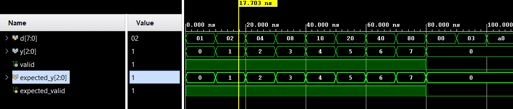

# Encoder 8-to-3


A combinational 8-to-3 one-hot encoder with `valid` output. Verification uses directed self-checking testbench.

## 📋 Specification / Architecture

| Parameter | Default | Description |
|-----------|---------|-------------|
| N/A       | N/A     | Fixed encoder 8-to-3 |

### Architecture Description

The combinational priority-style encoder (implemented as a one-hot encoder) maps an 8-bit one-hot input `d` into a 3-bit binary representation `y`. It asserts `valid` when an exact one-hot pattern matches. If an all-zero or multi-hot input is detected, `valid` is deasserted and `y` defaults to zero.

### Architecture Diagram (ASCII)

```text
                    encoder_8to3
               +-------------------+
        d[7] ->|                   |
        d[6] ->|                   |
        d[5] ->|                   |
        d[4] ->|      8-to-3       |---> y[2]
        d[3] ->|      Encoder      |---> y[1]
        d[2] ->|                   |---> y[0]
        d[1] ->|                   |
        d[0] ->|                   |---> valid
               +-------------------+


```

## 🔌 Port List / Interface

| Signal | Direction | Width | Description |
|--------|-----------|-------|-------------|
| `d`      | Input     | 8     | One-hot data input |
| `y`      | Output    | 3     | Encoded output |
| `valid`  | Output    | 1     | Valid for one-hot input |

## 🖥️ Simulation Results

Run simulation from either `sim/modelsim` or `sim/xsim` to view the waveform.


```text
=== ENCODER 8to3 Testbench ===
               10000 | d=00000001 | y=000 valid=1 | exp_y=000 exp_valid=1 | PASS
               20000 | d=00000010 | y=001 valid=1 | exp_y=001 exp_valid=1 | PASS
               30000 | d=00000100 | y=010 valid=1 | exp_y=010 exp_valid=1 | PASS
               40000 | d=00001000 | y=011 valid=1 | exp_y=011 exp_valid=1 | PASS
               50000 | d=00010000 | y=100 valid=1 | exp_y=100 exp_valid=1 | PASS
               60000 | d=00100000 | y=101 valid=1 | exp_y=101 exp_valid=1 | PASS
               70000 | d=01000000 | y=110 valid=1 | exp_y=110 exp_valid=1 | PASS
               80000 | d=10000000 | y=111 valid=1 | exp_y=111 exp_valid=1 | PASS
               90000 | d=00000000 | y=000 valid=0 | exp_y=000 exp_valid=0 | PASS
              100000 | d=00000011 | y=000 valid=0 | exp_y=000 exp_valid=0 | PASS
              110000 | d=10100000 | y=000 valid=0 | exp_y=000 exp_valid=0 | PASS
=== PASS: all 11 test vectors matched ===
```

## 🚀 How to Run

### Vivado xsim
```bash
cd sim/xsim && make sim

# Open waveform GUI view:
make gui

# Clean up simulation generated files:
make clean
```

### ModelSim / Questa
```bash
cd sim/modelsim && make sim

# Open waveform GUI view:
make gui

# Clean up simulation generated files:
make clean
```

### Portable Environment (Without Make)
```bash
# Vivado xsim
cd sim/xsim && xtclsh simulate.tcl

# ModelSim / Questa
cd sim/modelsim && vsim -c -do simulate.do
```

## ✅ Test Cases / Coverage

| Test | Input / Condition | Expected | Result |
|------|-------------------|----------|--------|
| `one_hot_valid` | 8 one-hot patterns | `y` equals bit index, `valid=1` | Pass |
| `invalid_zero` | `d=8'b00000000` | `valid=0` | Pass |
| `invalid_multi_hot` | Multi-hot patterns | `valid=0` | Pass |

## 🐛 Bugs Found

| Bug ID | Description | Fixed |
|--------|-------------|-------|
| None   | No bugs found in directed test | N/A |
