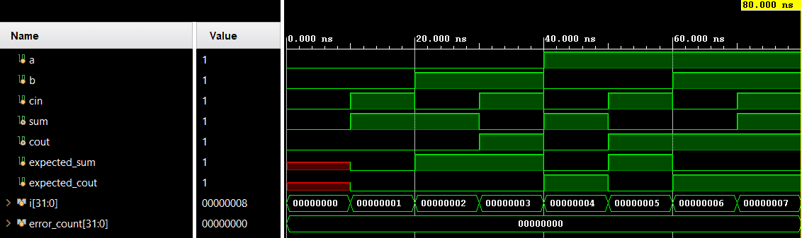

# Full Adder


A parameterizable combinational full adder that computes sum and carry-out from two operands and one carry-in. Verification is done using directed self-checking testbench (Verilog).

---

## 📋 Specification / Architecture

| Parameter | Default | Description |
|-----------|---------|-------------|
| `WIDTH`     | 1       | Data bus width |

## 🔌 Port List / Interface

| Signal | Direction | Width | Description |
|--------|-----------|-------|-------------|
| `a`      | Input     | `WIDTH` | Operand A |
| `b`      | Input     | `WIDTH` | Operand B |
| `cin`    | Input     | 1     | Carry input |
| `sum`    | Output    | `WIDTH` | Sum output |
| `cout`   | Output    | 1     | Carry output |

## 🖥️ Simulation Results

Run simulation from either `sim/modelsim` or `sim/xsim` to view the waveform.


```text
=== FULL ADDER Testbench ===
 time | a b cin | sum cout | exp_sum exp_cout | result
--------------------------------------------------------
               10000 | 0 0  0  |  0    0   |    0       0    | PASS
               20000 | 0 0  1  |  1    0   |    1       0    | PASS
               30000 | 0 1  0  |  1    0   |    1       0    | PASS
               40000 | 0 1  1  |  0    1   |    0       1    | PASS
               50000 | 1 0  0  |  1    0   |    1       0    | PASS
               60000 | 1 0  1  |  0    1   |    0       1    | PASS
               70000 | 1 1  0  |  0    1   |    0       1    | PASS
               80000 | 1 1  1  |  1    1   |    1       1    | PASS
=== PASS: all 8 test vectors matched ===
```

## 🚀 How to Run

### Vivado xsim
```bash
cd sim/xsim && make sim

# Open waveform GUI view:
make gui

# Clean up simulation generated files:
make clean
```

### ModelSim / Questa
```bash
cd sim/modelsim && make sim

# Open waveform GUI view:
make gui

# Clean up simulation generated files:
make clean
```

### Portable Environment (Without Make)
```bash
# Vivado xsim
cd sim/xsim && xtclsh simulate.tcl

# ModelSim / Questa
cd sim/modelsim && vsim -c -do simulate.do
```

## ✅ Test Cases / Coverage

| Test | Input / Condition | Expected | Result |
|------|-------------------|----------|--------|
| `all_combinations` | Directed test over all `{a,b,cin}` combinations (8 vectors) | `{cout,sum} = a + b + cin` | Pass |

## 🐛 Bugs Found

| Bug ID | Description | Fixed |
|--------|-------------|-------|
| None   | No bugs found in directed test | N/A |

