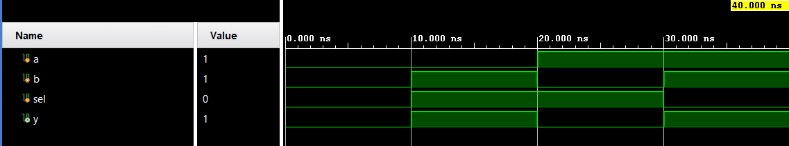

# MUX 2-to-1

A basic parameterizable 2-to-1 multiplexer that selects between two inputs based on a single select bit. Verification is done using Directed Testing (Verilog). Part of the RTL Design and Design Verification learning journey.

## 📋 Specification / Architecture

| Parameter | Default | Description |
|-----------|---------|-------------|
| WIDTH     | 1       | Data bus width |

## 🔌 Port List / Interface

| Signal | Direction | Width | Description |
|--------|-----------|-------|-------------|
| a      | Input     | WIDTH | Data input 0 |
| b      | Input     | WIDTH | Data input 1 |
| sel    | Input     | 1     | Select signal: 0→a, 1→b |
| y      | Output    | WIDTH | Data output |

## 🖥️ Simulation Results



## 🚀 How to Run

### Vivado xsim
```bash
cd sim/xsim && make sim
# Or open the GUI:
make gui
# Clean simulation files:
make clean
```

### ModelSim / Questa
```bash
cd sim/modelsim && make sim
# Or open the GUI:
make gui
# Clean simulation files:
make clean
```

### Portable (no make)
```bash
# Vivado xsim
cd sim/xsim && xtclsh simulate.tcl

# ModelSim / Questa
cd sim/modelsim && vsim -c -do simulate.do
```

## ✅ Test Cases / Coverage

| Test | Input / Condition | Expected | Result |
|------|-------|----------|--------|
| base_test | Directed test covering `{a,b,sel}` combinations | Output `y` matches selected input | Pass |

## 🐛 Bugs Found
| Bug ID | Description | Fixed |
|--------|-------------|-------|
| None   | No initial bugs found | N/A |
