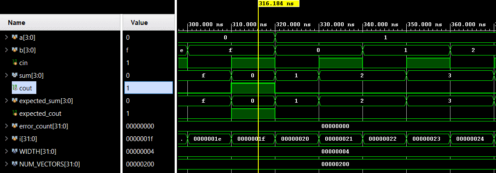

# Ripple Carry Adder

A parameterizable combinational ripple-carry adder. It adds two WIDTH-bit operands and a carry-in to produce WIDTH-bit sum and carry-out. Verification uses directed exhaustive self-checking testbench.

## 📋 Specification / Architecture

| Parameter | Default | Description |
|-----------|---------|-------------|
| WIDTH     | 4       | Data bus width of inputs `a`, `b`, and output `sum` |

## 🔌 Port List / Interface

| Signal | Direction | Width | Description |
|--------|-----------|-------|-------------|
| a      | Input     | WIDTH | Operand A |
| b      | Input     | WIDTH | Operand B |
| cin    | Input     | 1     | Carry input |
| sum    | Output    | WIDTH | Sum output |
| cout   | Output    | 1     | Carry output |

## 🖥️ Simulation Results

Run simulation from either `sim/modelsim` or `sim/xsim` to view waveform.


```text
=== RIPPLE CARRY ADDER Testbench ===
                time |    a    b cin | cout sum | exp_cout exp_sum | result
---------------------------------------------------------------
               10000 | 0000 0000  0  |   0   0000 |     0     0000 | PASS
               20000 | 0000 0000  1  |   0   0001 |     0     0001 | PASS
               30000 | 0000 0001  0  |   0   0001 |     0     0001 | PASS
                ...
                ...
                ...
             5110000 | 1111 1111  0  |   1   1110 |     1     1110 | PASS
             5120000 | 1111 1111  1  |   1   1111 |     1     1111 | PASS
=== PASS: all 512 test vectors matched ===
```

## 🚀 How to Run

### Vivado xsim
```bash
cd sim/xsim && make sim
# Or open the GUI:
make gui
# Clean simulation files:
make clean
```

### ModelSim / Questa
```bash
cd sim/modelsim && make sim
# Or open the GUI:
make gui
# Clean simulation files:
make clean
```

### Portable (no make)
```bash
# Vivado xsim
cd sim/xsim && xtclsh simulate.tcl

# ModelSim / Questa
cd sim/modelsim && vsim -c -do simulate.do
```

## ✅ Test Cases / Coverage

| Test | Input / Condition | Expected | Result |
|------|-------------------|----------|--------|
| exhaustive_width4 | All `{a,b,cin}` combinations for WIDTH=4 (512 vectors) | `{cout,sum} = a + b + cin` | Pass |
| corner_all_zero   | `a=0`, `b=0`, `cin=0` | `sum=0`, `cout=0` | Pass |
| corner_all_one    | `a=1111`, `b=1111`, `cin=1` | `sum=1111`, `cout=1` | Pass |

## 🐛 Bugs Found

| Bug ID | Description | Fixed |
|--------|-------------|-------|
| None   | No bugs found in directed test | N/A |

