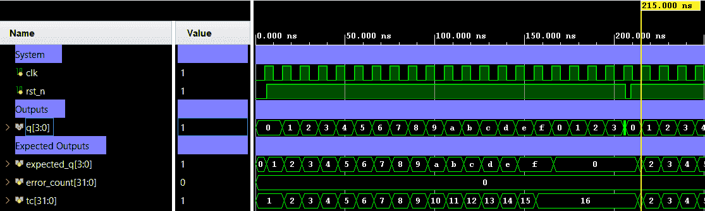

# 4-Bit Up Counter — Synchronous Counter with Async Reset


A 4-bit binary up counter with active-low asynchronous reset, triggered on the rising edge of the clock. The counter increments by 1 each cycle and wraps from `15` back to `0`. Verification is performed using a directed self-checking testbench (Verilog) covering full-cycle counting, rollover, and async reset behavior.

---

## 📋 Specification / Architecture

| Parameter | Default | Description                     |
|-----------|---------|---------------------------------|
| —         | —       | Fixed 4-bit width (no parameters) |

### Architecture Description

The counter uses a single `always` block sensitive to `posedge clk` and `negedge rst_n`:

- **Async reset** (`rst_n == 0`): `q` is immediately forced to `4'b0` regardless of clock.
- **Count up** (`rst_n == 1`): On each rising clock edge, `q` increments by 1.
- **Rollover**: Natural 4-bit overflow — after `4'hF`, the counter wraps to `4'h0`.

```
Q(t+1) = 0        if rst_n = 0   (async)
Q(t+1) = Q(t) + 1 if rst_n = 1  (on posedge clk)
```

### Architecture Diagram (ASCII)

#### Top-level Block Diagram

```text
           +--------------------+
           |                    |
   clk ───>|                    |
           |    counter_4bit    |====> q[3:0]
 rst_n ───>|                    |
           |                    |
           +--------------------+

```

#### Internal Architecture Diagram

```text
               4-bit Synchronous Counter (Feedback Loop)

            +----<--------------------------------<------------+
            |             q[3:0] (Feedback)                    |
            v                                                  |
      +-----------+          +---------------+                 |
      |           |  next_q  |   4-bit DFFs  |  q[3:0]         |
      | Increment |  [3:0]   |               |                 |
      |   (+1)    |==========|>D           Q |=================+====> q[3:0]
      |           |          |               |
      +-----------+          |               |
                             |  (DFFs)       |
 clk  ---------------------->|>              |
                             |               |
 rst_n --------------------->| rst_n         |
                             +---------------+

      Legend:
      ───  Single-bit (Control: clk, rst_n)
      ===  4-bit Bus (Data Path)
      |>   Edge-triggered input
```


---

## 🔌 Port List / Interface

| Signal  | Direction | Width | Description                           |
|---------|-----------|-------|---------------------------------------|
| `clk`   | Input     | 1     | Clock signal (rising-edge triggered)  |
| `rst_n` | Input     | 1     | Active-low asynchronous reset         |
| `q`     | Output    | 4     | 4-bit counter output                  |

---

## 🖥️ Simulation Results

Run simulation from `sim/xsim` to view the waveform.



```text
=== COUNTER_4BIT Testbench (4-bit Up Counter) ===
 status |  TC  |   time   | q (dec)
--------+------+----------+--------
   PASS |    0 |     6000 |  Reset: q=0
--- Count up 0 -> 15 ---
   PASS |    1 |    16000 |  q=1
   PASS |    2 |    26000 |  q=2
   PASS |    3 |    36000 |  q=3
   PASS |    4 |    46000 |  q=4
   PASS |    5 |    56000 |  q=5
   PASS |    6 |    66000 |  q=6
   PASS |    7 |    76000 |  q=7
   PASS |    8 |    86000 |  q=8
   PASS |    9 |    96000 |  q=9
   PASS |   10 |   106000 |  q=10
   PASS |   11 |   116000 |  q=11
   PASS |   12 |   126000 |  q=12
   PASS |   13 |   136000 |  q=13
   PASS |   14 |   146000 |  q=14
   PASS |   15 |   156000 |  q=15
   PASS | ROLL |   166000 |  rollover: q=0
   PASS |  RST |   209000 |  Async reset: q=0
--- Count after reset ---
   PASS |    1 |   216000 |  q=1
   PASS |    2 |   226000 |  q=2
   PASS |    3 |   236000 |  q=3
   PASS |    4 |   246000 |  q=4
   PASS |    5 |   256000 |  q=5
--------------------------------------------
=== PASS: all test vectors matched ===
```

---

## 🚀 How to Run

### Vivado xsim
```bash
cd sim/xsim && make sim

# Open waveform GUI view:
make gui

# Clean up simulation generated files:
make clean
```

### Portable Environment (Without Make)
```bash
cd sim/xsim && xtclsh simulate.tcl
```

---

## ✅ Test Cases / Coverage

| Test               | Input / Condition                          | Expected              | Result  |
|--------------------|--------------------------------------------|-----------------------|---------|
| Async reset hold   | `rst_n=0` at any time                      | `q=0` immediately     | ✅ Pass |
| Count up 0→15      | `rst_n=1`, 15 rising edges                 | `q` = 1, 2, …, 15    | ✅ Pass |
| Rollover 15→0      | `rst_n=1`, edge after `q=15`               | `q=0`                 | ✅ Pass |
| Async reset mid-count | `rst_n` de-asserted during count        | `q=0` without clock   | ✅ Pass |
| Count after reset  | Resume counting after reset                | `q` = 1, 2, 3, 4, 5  | ✅ Pass |

**Total: 25+ test vectors — 0 failures**

---

## 🐛 Bugs Found

| Bug ID | Description           | Fixed |
|--------|-----------------------|-------|
| None   | No bugs found         | N/A   |
