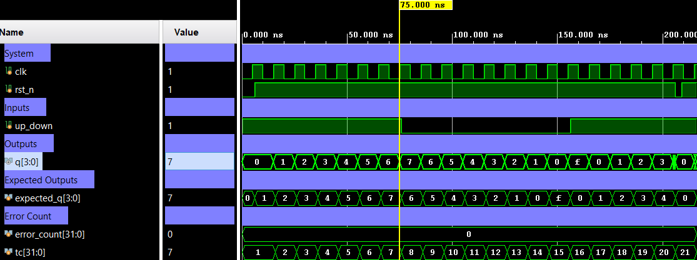

# 4-Bit Up/Down Counter — Bidirectional Counter with Async Reset


A 4-bit bidirectional binary counter with active-low asynchronous reset, controlled by a direction signal `up_down`. When `up_down = 1` the counter increments; when `up_down = 0` it decrements. Both directions wrap naturally on 4-bit overflow/underflow. Verification is performed using a directed self-checking testbench (Verilog) covering count-up, count-down, underflow wrap, and async reset.

---

## 📋 Specification / Architecture

| Parameter | Default | Description                      |
|-----------|---------|----------------------------------|
| —         | —       | Fixed 4-bit width (no parameters) |

### Architecture Description

A single `always` block sensitive to `posedge clk` and `negedge rst_n`:

- **Async reset** (`rst_n == 0`): `q` is immediately forced to `4'b0`.
- **Count up** (`rst_n == 1`, `up_down == 1`): `q` increments by 1 on each rising edge.
- **Count down** (`rst_n == 1`, `up_down == 0`): `q` decrements by 1 on each rising edge.
- Overflow/underflow wraps naturally with 4-bit arithmetic.

```
Q(t+1) = 0          if rst_n = 0       (async)
Q(t+1) = Q(t) + 1   if up_down = 1     (on posedge clk)
Q(t+1) = Q(t) - 1   if up_down = 0     (on posedge clk)
```

### Architecture Diagram (ASCII)

#### Top-level Block Diagram

```text
                             +--------------------+
                             |   counter_updown   |
                             |                    |
      clk      ------------->|                    |
                             |                    |
      rst_n    ------------->|                    |===============>  q[3:0]
                             |                    |
      up_down  ------------->|                    |
                             |                    |
                             +--------------------+

```


#### Internal Architecture Diagram

```text
                                    4-bit Up/Down Synchronous Counter
                                    =================================

                            +-------------------------------------------------+
                            |             q[3:0] (Current State)              |
                            |                                                 |
                            |                                                 |
                    +-------v-------+            +-----------------+          |
                    |  Increment/   |   next_q   |                 |          |
                    |  Decrement    |   [3:0]    |     4-bit       |          |
               ---->|               |============|>D         Q     |==========+====> q[3:0]
               up   |  Logic (+/-1) |            |     Register    |
                    +-------^-------+            |      (DFFs)     |
                            |                    |                 |
                            |                    |                 |
                clk  -------+--------------------|>                |
                                                 |                 |
              rst_n  ---------------------------o| rst_n           |
                                                 +-----------------+


     Legend:
     ───  Single-bit (up, clk, rst_n)
     ===  4-bit Bus (Data Path)
     |>   Positive Edge Trigger
     o    Active Low (rst_n)
```

---

## 🔌 Port List / Interface

| Signal    | Direction | Width | Description                            |
|-----------|-----------|-------|----------------------------------------|
| `clk`     | Input     | 1     | Clock signal (rising-edge triggered)   |
| `rst_n`   | Input     | 1     | Active-low asynchronous reset          |
| `up_down` | Input     | 1     | Direction: `1` = up, `0` = down        |
| `q`       | Output    | 4     | 4-bit counter output                   |

---

## 🖥️ Simulation Results

Run simulation from `sim/xsim` to view the waveform.



```text
=== COUNTER_UPDOWN Testbench (4-bit Up/Down Counter) ===
 status |  TC  |   time   | up_down | q (dec)
--------------------------------------------------
   PASS |    0 |     6000 | Reset: q=0
--- Count UP: 0 -> 7 ---
   PASS |    1 |    16000 | up_down=1 | q=1
   PASS |    2 |    26000 | up_down=1 | q=2
   PASS |    3 |    36000 | up_down=1 | q=3
   PASS |    4 |    46000 | up_down=1 | q=4
   PASS |    5 |    56000 | up_down=1 | q=5
   PASS |    6 |    66000 | up_down=1 | q=6
   PASS |    7 |    76000 | up_down=1 | q=7
--- Count DOWN: 7 -> 0 ---
   PASS |    8 |    86000 | up_down=0 | q=6
   PASS |    9 |    96000 | up_down=0 | q=5
   PASS |   10 |   106000 | up_down=0 | q=4
   PASS |   11 |   116000 | up_down=0 | q=3
   PASS |   12 |   126000 | up_down=0 | q=2
   PASS |   13 |   136000 | up_down=0 | q=1
   PASS |   14 |   146000 | up_down=0 | q=0
--- Down rollover: 0 -> 15 ---
   PASS |   15 |   156000 | up_down=0 | q=15
--- Count UP: 15 -> high values ---
   PASS |   16 |   166000 | up_down=1 | q=0
   PASS |   17 |   176000 | up_down=1 | q=1
   PASS |   18 |   186000 | up_down=1 | q=2
   PASS |   19 |   196000 | up_down=1 | q=3
   PASS |   20 |   206000 | up_down=1 | q=4
   PASS |  RST |   209000 | Async reset: q=0
--------------------------------------------------
=== PASS: all test vectors matched ===
```

---

## 🚀 How to Run

### Vivado xsim
```bash
cd sim/xsim && make sim

# Open waveform GUI view:
make gui

# Clean up simulation generated files:
make clean
```

### Portable Environment (Without Make)
```bash
cd sim/xsim && xtclsh simulate.tcl
```

---

## ✅ Test Cases / Coverage

| Test                | Input / Condition                           | Expected              | Result  |
|---------------------|---------------------------------------------|-----------------------|---------|
| Async reset hold    | `rst_n=0` at any time                       | `q=0` immediately     | ✅ Pass |
| Count up 0→7        | `up_down=1`, 7 rising edges                 | `q` = 1, 2, …, 7     | ✅ Pass |
| Count down 7→0      | `up_down=0`, 7 rising edges                 | `q` = 6, 5, …, 0     | ✅ Pass |
| Underflow wrap 0→15 | `up_down=0` when `q=0`                      | `q=15`                | ✅ Pass |
| Count up after wrap | `up_down=1` from 15, 5 edges               | `q` = 0, 1, 2, 3, 4  | ✅ Pass |
| Async reset mid-count | `rst_n` de-asserted during count          | `q=0` without clock   | ✅ Pass |

**Total: 22+ test vectors — 0 failures**

---

## 🐛 Bugs Found

| Bug ID | Description   | Fixed |
|--------|---------------|-------|
| None   | No bugs found | N/A   |
