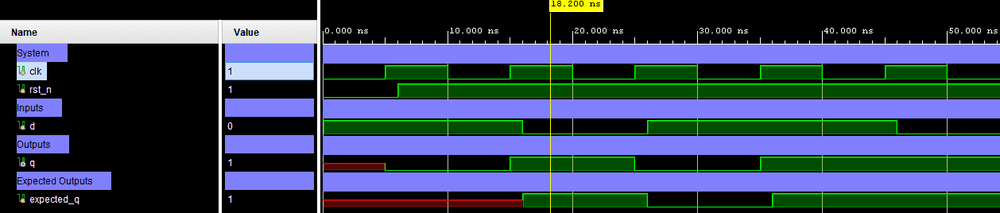

# D Flip-Flop (DFF) — Edge-Triggered Register with Synchronous Reset


A 1-bit D Flip-Flop with active-low synchronous reset, triggered on the rising edge of the clock. Data at input `d` is captured into output `q` on each positive clock edge; when `rst_n` is de-asserted, `q` is forced to `0` synchronously. Verification is performed using a directed self-checking testbench (Verilog).

---

## 📋 Specification / Architecture

| Parameter | Default | Description           |
|-----------|---------|-----------------------|
| —         | —       | No configurable parameters (fixed 1-bit width) |

### Architecture Description

The DFF operates entirely on the rising edge of `clk`. Priority is given to the synchronous reset:

- **Reset condition** (`rst_n == 0`): On the rising edge, `q` is driven to `1'b0` regardless of `d`.
- **Normal operation** (`rst_n == 1`): On the rising edge, `q` captures the value of `d`.

Transfer equation:

```
Q(t+1) = 0          if rst_n = 0
Q(t+1) = D(t)       if rst_n = 1
```

### Architecture Diagram (ASCII)

```text

         ┌────────────────────┐
    d ──►│                    │
         │                    │
 clk ───►│         DFF        │──► q
         │                    │
rst_n ──►│                    │
         └────────────────────┘
```

---

## 🔌 Port List / Interface

| Signal  | Direction | Width | Description                          |
|---------|-----------|-------|--------------------------------------|
| `clk`   | Input     | 1     | Clock signal (rising-edge triggered) |
| `rst_n` | Input     | 1     | Active-low synchronous reset         |
| `d`     | Input     | 1     | Data input                           |
| `q`     | Output    | 1     | Registered data output               |

---

## 🖥️ Simulation Results

Run simulation from `sim/xsim` to view the waveform.



```text
=== DFF Testbench (Synchronous Reset) ===
 status |     time |  rst_n d | q | note
--------+----------+----------+---+----------------
 PASS   |     6000 |   0    x | 0 | reset holds
 PASS   |    16000 |   1    1 | 1 |
 PASS   |    26000 |   1    0 | 0 |
 PASS   |    36000 |   1    1 | 1 |
 PASS   |    46000 |   1    1 | 1 |
 PASS   |    56000 |   1    0 | 0 |
------------------------------------------
=== PASS: all test vectors matched ===
```

---

## 🚀 How to Run

### Vivado xsim
```bash
cd sim/xsim && make sim

# Open waveform GUI view:
make gui

# Clean up simulation generated files:
make clean
```

### Portable Environment (Without Make)
```bash
# Vivado xsim
cd sim/xsim && xtclsh simulate.tcl
```

---

## ✅ Test Cases / Coverage

| Test              | Input / Condition                       | Expected         | Result  |
|-------------------|-----------------------------------------|------------------|-------- |
| Reset hold        | `rst_n=0`, `d=x` at posedge clk         | `q=0`            | ✅ Pass |
| Data capture 1    | `rst_n=1`, `d=1` at posedge clk         | `q=1`            | ✅ Pass |
| Data capture 0    | `rst_n=1`, `d=0` at posedge clk         | `q=0`            | ✅ Pass |
| Data hold high    | `rst_n=1`, `d=1` (same value retained)  | `q=1`            | ✅ Pass |
| Data toggle       | `rst_n=1`, `d=1` then `d=0`             | `q` follows `d`  | ✅ Pass |

**Total: 6 test vectors — 0 failures**

---

## 🐛 Bugs Found

| Bug ID | Description                                                                 | Fixed |
|--------|-----------------------------------------------------------------------------|-------|
| BUG-01 | Missing `` `timescale `` directive caused elaboration warning in Vivado xsim | ✅ Yes |
