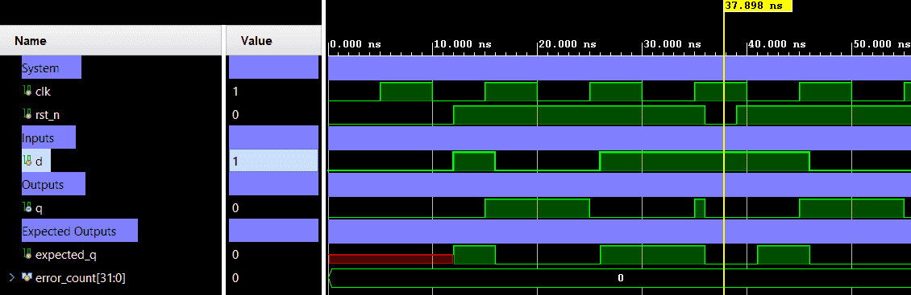

# D Flip-Flop with Async Reset — Edge-Triggered Register (Async Active-Low Reset)


A 1-bit D Flip-Flop with active-low **asynchronous** reset, triggered on the rising edge of the clock. Unlike its synchronous counterpart (`dff`), the reset here takes effect immediately upon de-assertion of `rst_n` — independent of the clock edge. Verification is performed using a directed self-checking testbench (Verilog), including a key test that asserts reset mid-cycle without waiting for a clock edge.

---

## 📋 Specification / Architecture

| Parameter | Default | Description                            |
|-----------|---------|----------------------------------------|
| —         | —       | Fixed 1-bit width (no parameters)      |

### Architecture Description

The `always` block is sensitive to **both** `posedge clk` and **`negedge rst_n`**:

- **Async reset** (`rst_n == 0`): `q` is forced to `1'b0` **immediately**, without waiting for a clock edge.
- **Normal operation** (`rst_n == 1`): On the rising clock edge, `q` captures the value of `d`.

This is the critical behavioral difference from a synchronous reset DFF:

```
q = 0         if rst_n = 0  (async — any time, no clock needed)
Q(t+1) = D(t) if rst_n = 1  (on posedge clk)
```

### Architecture Diagram (ASCII)

```text
                +----------------------+
   d    ------->|                      |
                |                      |
   clk  ------->|        DFF           |-----> q
                |                      |
 rst_n  ------->| async reset (low)    |
                +----------------------+
```

---

## 🔌 Port List / Interface

| Signal  | Direction | Width | Description                                |
|---------|-----------|-------|--------------------------------------------|
| `clk`   | Input     | 1     | Clock signal (rising-edge triggered)       |
| `rst_n` | Input     | 1     | Active-low **asynchronous** reset          |
| `d`     | Input     | 1     | Data input                                 |
| `q`     | Output    | 1     | Registered data output                     |

---

## 🖥️ Simulation Results

Run simulation from `sim/xsim` to view the waveform.



```text
=== DFF_ASYNC_RESET Testbench ===
 status |     time |  rst_n d | q | note
------------------------------------------
 PASS   |    12000 |   0    x | 0 (exp 0)| reset holds
 PASS   |    16000 |   1    1 | 1 (exp 1)|
 PASS   |    26000 |   1    0 | 0 (exp 0)|
 PASS   |    36000 |   1    1 | 1 (exp 1)|
 PASS   |    39000 |   Async reset cleared q (q=0) immediately
 PASS   |    46000 |   1    1 | 1 (exp 1)|
 PASS   |    56000 |   1    0 | 0 (exp 0)|
------------------------------------------
=== PASS: all test vectors matched ===
```

---

## 🚀 How to Run

### Vivado xsim
```bash
cd sim/xsim && make sim

# Open waveform GUI view:
make gui

# Clean up simulation generated files:
make clean
```

### Portable Environment (Without Make)
```bash
cd sim/xsim && xtclsh simulate.tcl
```

---

## ✅ Test Cases / Coverage

| Test                      | Input / Condition                              | Expected                    | Result  |
|---------------------------|------------------------------------------------|-----------------------------|---------|
| Initial async reset       | `rst_n=0` for 12 ns (no clock edge)            | `q=0` immediately           | ✅ Pass |
| Data capture 1            | `rst_n=1`, `d=1` at posedge clk               | `q=1`                       | ✅ Pass |
| Data capture 0            | `rst_n=1`, `d=0` at posedge clk               | `q=0`                       | ✅ Pass |
| Data capture 1 again      | `rst_n=1`, `d=1` at posedge clk               | `q=1`                       | ✅ Pass |
| **Async reset mid-cycle** | `rst_n=0` asserted 3 ns into clock period      | `q=0` **without clock edge** | ✅ Pass |
| Resume after reset        | `rst_n=1`, `d=1` at posedge clk               | `q=1`                       | ✅ Pass |
| Resume after reset        | `rst_n=1`, `d=0` at posedge clk               | `q=0`                       | ✅ Pass |

**Total: 7 test vectors — 0 failures**

---

## 🐛 Bugs Found

| Bug ID | Description   | Fixed |
|--------|---------------|-------|
| None   | No bugs found | N/A   |
