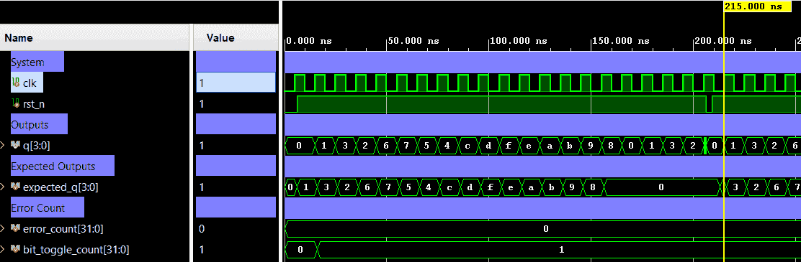

# Gray Counter — Parameterized N-Bit Counter


A parameterized N-bit Gray code counter with an active-low asynchronous reset.
It uses an internal binary counter to keep track of the count, and generates a Gray-coded output (`q`) where consecutive states differ by exactly one bit. This design utilizes an output register to ensure glitch-free transitions, operating cleanly as a pipeline. Verification is provided via a self-checking testbench ensuring all 16 states, rollover behavior, and exactly-1-bit-change validation.

> 📖 **Read more:** Explanation and examples of the algorithm are available at [Gray Counter Theory](../../docs/gray_counter_theory.md)

---

## 📋 Specification / Architecture

| Parameter | Default | Description                               |
|-----------|---------|-------------------------------------------|
| `WIDTH`   | `4`     | Number of bits for the Gray code counter  |

### Architecture Description

The counter increments its internal binary count at every rising clock edge. The output is concurrently generated using the standard Binary-to-Gray translation logic on the *next* binary value `(bin + 1)`.

```text
next_bin = bin_count(t) + 1
Gray(x)  = (x >> 1) ^ x

Q(t+1) = Gray(next_bin)   if rst_n = 1  (on posedge clk)
Q(t+1) = 4'b0000          if rst_n = 0  (async)
```

**16-state sequence (Example for WIDTH=4)** (starting from reset state `0000`):

| Cycle | Binary Count | Gray Output `q` | Output (hex) |
|-------|--------------|-----------------|--------------|
| 0     | `0000`       | `0000`          | `0x0` (reset)|
| 1     | `0001`       | `0001`          | `0x1`        |
| 2     | `0010`       | `0011`          | `0x3`        |
| 3     | `0011`       | `0010`          | `0x2`        |
| 4     | `0100`       | `0110`          | `0x6`        |
| 5     | `0101`       | `0111`          | `0x7`        |
| 6     | `0110`       | `0101`          | `0x5`        |
| 7     | `0111`       | `0100`          | `0x4`        |
| 8     | `1000`       | `1100`          | `0xC`        |
| 9     | `1001`       | `1101`          | `0xD`        |
| 10    | `1010`       | `1111`          | `0xF`        |
| 11    | `1011`       | `1110`          | `0xE`        |
| 12    | `1100`       | `1010`          | `0xA`        |
| 13    | `1101`       | `1011`          | `0xB`        |
| 14    | `1110`       | `1001`          | `0x9`        |
| 15    | `1111`       | `1000`          | `0x8`        |
| 16    | `0000`       | `0000`          | `0x0` (wraps)|

### Architecture Diagram (ASCII)

#### Top-level Block Diagram

```text
                       ┌─────────────────────────┐
                       │                         │
            clk ──────►│                         │
                       │       GRAY COUNTER      ├───► q[WIDTH-1:0]
          rst_n ──────►│         (N-bit)         │
                       │                         │
                       └─────────────────────────┘
```

#### Internal Architecture Diagram

```text
                                                N-bit Gray Counter
                                        ====================================

                      ┌──────────┐          ┌───────────┐         ┌──────────┐          ┌──────────┐
                ┌────►│ D      Q ├─────────►│  + 1'b1   ├───┬────►│ bin2gray ├─────────►│ D      Q ├───► q[WIDTH-1:0]
                │     │          │bin_count │           │   │     │G=B^(B>>1)│ next_q   │          │
                │     │bin_count │          └───────────┘   │     └──────────┘          │ Output q │
                │     │   Reg    │             next_bin     │                           │   Reg    │
                │     │          │                          │                           │          │
             ┌──┼────►│>  CLRn   │                          │                      ┌───►│>  CLRn   │
             │  │     └────o─────┘                          │                      │    └────o─────┘
             │  │          │                                │                      │         │
             │  └──────────┼────────────────────────────────┘                      │         │
             │             │                                                       │         │
        clk ─┴─────────────┼───────────────────────────────────────────────────────┘         │
                           │                                                                 │
     rst_n  ───────────────┴─────────────────────────────────────────────────────────────────┘

```

---

## 🔌 Port List / Interface

| Signal  | Direction | Width   | Description                          |
|---------|-----------|---------|--------------------------------------|
| `clk`   | Input     | 1       | Clock signal (rising-edge triggered) |
| `rst_n` | Input     | 1       | Active-low asynchronous reset        |
| `q`     | Output    | `WIDTH` | N-bit Gray code output               |

---

## 🖥️ Simulation Results

Run simulation from `sim/xsim` to view the waveform.



*(Note: Testbench trace outputs a fully verified scoreboard covering all transitions.)*

```text
=== GRAY_COUNTER Testbench (4-bit, mod-16) ===
 status |  TC  |   time   | q (bin)
-------------------------------------------
   PASS |    0 |     6000 | Reset: q=0000
   PASS |    1 |    16000 | q=0001
   PASS |    2 |    26000 | q=0011
   PASS |    3 |    36000 | q=0010
   PASS |    4 |    46000 | q=0110
   PASS |    5 |    56000 | q=0111
   PASS |    6 |    66000 | q=0101
   PASS |    7 |    76000 | q=0100
   PASS |    8 |    86000 | q=1100
   PASS |    9 |    96000 | q=1101
   PASS |   10 |   106000 | q=1111
   PASS |   11 |   116000 | q=1110
   PASS |   12 |   126000 | q=1010
   PASS |   13 |   136000 | q=1011
   PASS |   14 |   146000 | q=1001
   PASS |   15 |   156000 | q=1000
   PASS |   16 |   166000 | q=0000
   PASS |  RST |   209000 | Async reset: q=0000
   PASS |    1 |   216000 | q=0001
   PASS |    2 |   226000 | q=0011
   PASS |    3 |   236000 | q=0010
   PASS |    4 |   246000 | q=0110
   PASS |    5 |   256000 | q=0111
-------------------------------------------
=== PASS: all test vectors matched ===
```

---

## 🚀 How to Run

### Vivado xsim
```bash
cd sim/xsim && make sim

# Open waveform GUI view:
make gui

# Clean up simulation generated files:
make clean
```

### Portable Environment (Without Make)
```bash
cd sim/xsim && xtclsh simulate.tcl
```

---

## ✅ Test Cases / Coverage

| Test                   | Input / Condition                             | Expected                        | Result  |
|------------------------|-----------------------------------------------|---------------------------------|---------|
| Async reset hold       | `rst_n=0` at posedge clk                      | `q=0000`                        | ✅ Pass |
| Full cycle (16 states) | `rst_n=1`, 16 rising edges                    | Sequence per table above        | ✅ Pass |
| Rollover logic         | After 16th clock edge                         | `q=0000` (wraps)                | ✅ Pass |
| Bit-toggle check       | Dynamic toggle validation during seq          | Exactly 1 bit changes/cycle     | ✅ Pass |
| Async reset mid-seq    | `rst_n=0` 3 ns into clock period              | `q=0000` without clock edge     | ✅ Pass |
| Sequence after reset   | 5 rising edges after reset                    | Sequence restarts from `0000`   | ✅ Pass |

**Total: 24 test vectors (16 Gray sequence + 1 rollover + 1 async reset + 5 post-reset + 1 toggle validation) — 0 failures**


---

## 🐛 Bugs Found

| Bug ID | Description   | Fixed |
|--------|---------------|-------|
| None   | No bugs found | N/A   |
