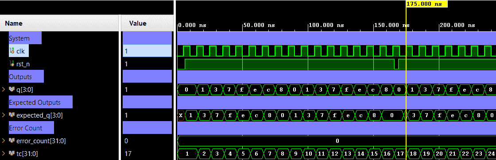

# Johnson Counter — 4-Bit Ring Counter (8-State Sequence)


A 4-bit Johnson counter (also known as a twisted-ring counter) that cycles through 8 unique states. Each clock edge, the inverted MSB (`~q[3]`) is shifted into the LSB position, producing a Gray-code-like sequence with only one bit changing per transition. Verification is performed using a directed self-checking testbench (Verilog) with a pre-defined golden sequence table covering 2 full cycles and an async reset check.

---

## 📋 Specification / Architecture

| Parameter | Default | Description                       |
|-----------|---------|-----------------------------------|
| —         | —       | Fixed 4-bit width (no parameters) |

### Architecture Description

The counter shifts left at every rising clock edge, feeding back the complement of the outgoing MSB into the LSB:

```
Q(t+1) = {Q[2:0], ~Q[3]}   if rst_n = 1  (on posedge clk)
Q(t+1) = 4'b0000           if rst_n = 0  (async)
```

**8-state sequence** (starting from reset state `0000`):

| Cycle | State (binary) | State (hex) |
|-------|----------------|-------------|
| 0     | `0000`         | `0x0` (reset) |
| 1     | `0001`         | `0x1`       |
| 2     | `0011`         | `0x3`       |
| 3     | `0111`         | `0x7`       |
| 4     | `1111`         | `0xF`       |
| 5     | `1110`         | `0xE`       |
| 6     | `1100`         | `0xC`       |
| 7     | `1000`         | `0x8`       |
| 8     | `0000`         | `0x0` (wraps) |

### Architecture Diagram (ASCII)

#### Top-level Block Diagram

```text
                       ┌─────────────────────────┐
                       │                         │
            clk ──────►│                         │
                       │     JOHNSON COUNTER     ├───► q[3:0]
          rst_n ──────►│     (4-bit)             │
                       │                         │
                       └─────────────────────────┘

```

#### Internal Architecture Diagram

```text
                                          4-bit Johnson Counter
                                    =================================
               ┌─────────┐
         ┌─────┤   NOT   │◄───────────────────────────────────────────────────────────────────────────┐
         │     └─────────┘                                                                            │
         │                                                                                            │
         │     ┌──────────┐            ┌──────────┐            ┌──────────┐            ┌──────────┐   │
         └────►│D      Q  ├───┬───────►│D      Q  ├───┬───────►│D      Q  ├───┬───────►│D      Q  ├───┴──► q[3]
               │   DFF0   │   │        │   DFF1   │   │        │   DFF2   │   │        │   DFF3   │
               │          │   │        │          │   │        │          │   │        │          │
               │          │   │        │          │   │        │          │   │        │          │
            ┌─►│>   CLRn  │   │     ┌─►│>   CLRn  │   │     ┌─►│>   CLRn  │   │     ┌─►│>   CLRn  │
            │  └────o─────┘   │     │  └────o─────┘   │     │  └────o─────┘   │     │  └────o─────┘
            │       │         │     │       │         │     │       │         │     │       │
       clk ─┴───────┼─────────┼─────┴───────┼─────────┼─────┴───────┼─────────┼─────┘       │
                    │         │             │         │             │         │             │
      rst_n ────────┴─────────┼─────────────┴─────────┼─────────────┴─────────┼─────────────┘
                              │                       │                       │
                              ▼                       ▼                       ▼
                              q[0]                    q[1]                    q[2]

```


---

## 🔌 Port List / Interface

| Signal  | Direction | Width | Description                          |
|---------|-----------|-------|--------------------------------------|
| `clk`   | Input     | 1     | Clock signal (rising-edge triggered) |
| `rst_n` | Input     | 1     | Active-low asynchronous reset        |
| `q`     | Output    | 4     | 4-bit Johnson counter output         |

---

## 🖥️ Simulation Results

Run simulation from `sim/xsim` to view the waveform.



```text
=== JOHNSON_COUNTER Testbench (4-bit, 8-state) ===
 status |  TC  |   time   | q (bin)
-------------------------------------------
   PASS |    0 |     6000 | Reset: q=0000
--- Cycle 1 ---
   PASS |    1 |    16000 | q=0001
   PASS |    2 |    26000 | q=0011
   PASS |    3 |    36000 | q=0111
   PASS |    4 |    46000 | q=1111
   PASS |    5 |    56000 | q=1110
   PASS |    6 |    66000 | q=1100
   PASS |    7 |    76000 | q=1000
   PASS |    8 |    86000 | q=0000
--- Cycle 2 ---
   PASS |    9 |    96000 | q=0001
   PASS |   10 |   106000 | q=0011
   PASS |   11 |   116000 | q=0111
   PASS |   12 |   126000 | q=1111
   PASS |   13 |   136000 | q=1110
   PASS |   14 |   146000 | q=1100
   PASS |   15 |   156000 | q=1000
   PASS |   16 |   166000 | q=0000
   PASS |  RST |   169000 | Async reset: q=0000
--- Cycle after reset ---
   PASS |   17 |   176000 | q=0001
   PASS |   18 |   186000 | q=0011
   PASS |   19 |   196000 | q=0111
   PASS |   20 |   206000 | q=1111
   PASS |   21 |   216000 | q=1110
   PASS |   22 |   226000 | q=1100
   PASS |   23 |   236000 | q=1000
   PASS |   24 |   246000 | q=0000
-------------------------------------------
=== PASS: all test vectors matched ===
```

---

## 🚀 How to Run

### Vivado xsim
```bash
cd sim/xsim && make sim

# Open waveform GUI view:
make gui

# Clean up simulation generated files:
make clean
```

### Portable Environment (Without Make)
```bash
cd sim/xsim && xtclsh simulate.tcl
```

---

## ✅ Test Cases / Coverage

| Test                   | Input / Condition                             | Expected                        | Result  |
|------------------------|-----------------------------------------------|---------------------------------|---------|
| Async reset hold       | `rst_n=0` at posedge clk                      | `q=0000`                        | ✅ Pass |
| Full cycle 1 (8 states)| `rst_n=1`, 8 rising edges                     | Sequence per table above        | ✅ Pass |
| Full cycle 2 (8 states)| Continue from cycle 1                         | Same sequence repeats           | ✅ Pass |
| Async reset mid-seq    | `rst_n=0` 3 ns into clock period              | `q=0000` without clock edge     | ✅ Pass |
| Full cycle after reset | 8 rising edges after reset                    | Sequence restarts from `0001`   | ✅ Pass |

**Total: 25 test vectors — 0 failures**

---

## 🐛 Bugs Found

| Bug ID | Description   | Fixed |
|--------|---------------|-------|
| None   | No bugs found | N/A   |
