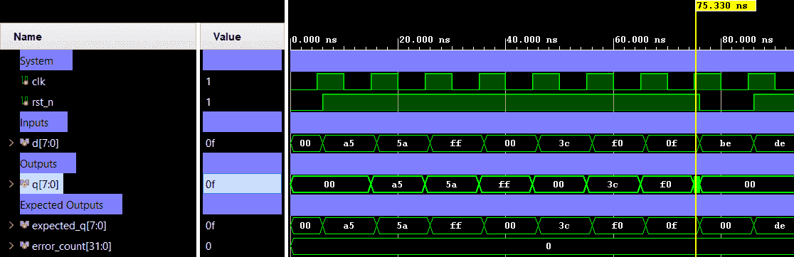

# 8-Bit Parallel Register — Parallel-Load Register with Async Reset


An 8-bit parallel-in parallel-out (PIPO) register with active-low asynchronous reset. On each rising clock edge, the 8-bit input `d` is latched into output `q`. When `rst_n` is de-asserted, `q` is immediately cleared to `8'h00` independent of the clock. Verification is performed using a directed self-checking testbench (Verilog) with boundary patterns (all-ones, all-zeros, alternating bits) and an async reset check mid-operation.

---

## 📋 Specification / Architecture

| Parameter | Default | Description                       |
|-----------|---------|-----------------------------------|
| —         | —       | Fixed 8-bit width (no parameters) |

### Architecture Description

A single `always` block sensitive to `posedge clk` and `negedge rst_n`:

- **Async reset** (`rst_n == 0`): `q` is immediately driven to `8'h00`.
- **Load** (`rst_n == 1`): On the rising clock edge, `q <= d` (full 8-bit parallel capture).

```
Q(t+1) = 8'h00   if rst_n = 0   (async)
Q(t+1) = D(t)    if rst_n = 1   (on posedge clk)
```

### Architecture Diagram (ASCII)

```text
         ┌──────────────────────────────────┐
  clk ──►│ posedge trigger                  │
         │                                  │
 rst_n ──►  if (!rst_n) q <= 8'h00;        ├──► q [7:0]
  (neg)  │  else        q <= d;             │
d [7:0] ►│                                  │
         └──────────────────────────────────┘
```

---

## 🔌 Port List / Interface

| Signal  | Direction | Width | Description                          |
|---------|-----------|-------|--------------------------------------|
| `clk`   | Input     | 1     | Clock signal (rising-edge triggered) |
| `rst_n` | Input     | 1     | Active-low asynchronous reset        |
| `d`     | Input     | 8     | 8-bit parallel data input            |
| `q`     | Output    | 8     | 8-bit registered output              |

---

## 🖥️ Simulation Results

Run simulation from `sim/xsim` to view the waveform.




```text
=== REGISTER_8BIT Testbench ===
 status |  TC  |   time   | rst_n |   d  |   q
--------+------+----------+-------+------+--------
 PASS   |    1 |     6000 |   0   |  --  | 0x00
 PASS   |    1 |    16000 |   1   | 0xa5 | 0xa5
 PASS   |    2 |    26000 |   1   | 0x5a | 0x5a
 PASS   |    3 |    36000 |   1   | 0xff | 0xff
 PASS   |    4 |    46000 |   1   | 0x00 | 0x00
 PASS   |    5 |    56000 |   1   | 0x3c | 0x3c
 PASS   |    6 |    66000 |   1   | 0xf0 | 0xf0
 PASS   |    7 |    76000 |   1   | 0x0f | 0x0f
 PASS   |  RST |    86000 |   0   |  --  | 0x00
 PASS   |    8 |    96000 |   1   | 0xde | 0xde
------------------------------------------------
=== PASS: all test vectors matched ===
```

---

## 🚀 How to Run

### Vivado xsim
```bash
cd sim/xsim && make sim

# Open waveform GUI view:
make gui

# Clean up simulation generated files:
make clean
```

### Portable Environment (Without Make)
```bash
cd sim/xsim && xtclsh simulate.tcl
```

---

## ✅ Test Cases / Coverage

| Test                     | Input / Condition                       | Expected          | Result  |
|--------------------------|-----------------------------------------|-------------------|---------|
| Async reset hold         | `rst_n=0` at posedge clk               | `q=0x00`          | ✅ Pass |
| Alternating bits `0xA5`  | `d=8'hA5`, posedge clk                 | `q=0xA5`          | ✅ Pass |
| Complement `0x5A`        | `d=8'h5A`, posedge clk                 | `q=0x5A`          | ✅ Pass |
| All ones `0xFF`          | `d=8'hFF`, posedge clk                 | `q=0xFF`          | ✅ Pass |
| All zeros `0x00`         | `d=8'h00`, posedge clk                 | `q=0x00`          | ✅ Pass |
| Arbitrary patterns       | `0x3C`, `0xF0`, `0x0F`                 | `q` mirrors `d`   | ✅ Pass |
| Async reset mid-op       | `rst_n=0` during `d=0xBE` on clock     | `q=0x00`          | ✅ Pass |
| Resume after reset       | `d=0xDE`, posedge clk                  | `q=0xDE`          | ✅ Pass |

**Total: 10 test vectors — 0 failures**

---

## 🐛 Bugs Found

| Bug ID | Description   | Fixed |
|--------|---------------|-------|
| None   | No bugs found | N/A   |
