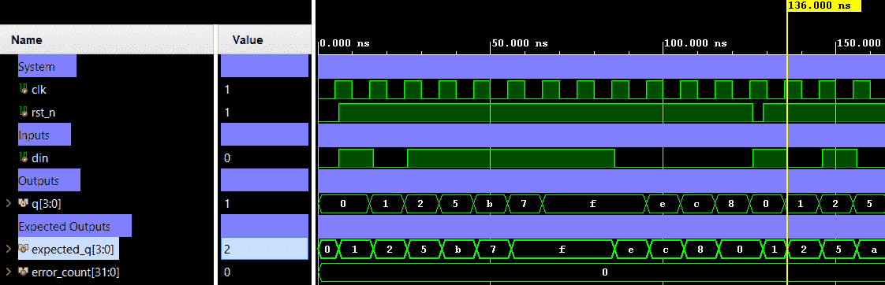

# 4-Bit Shift Register — Serial-In Parallel-Out (SIPO) with Async Reset


A 4-bit Serial-In Parallel-Out (SIPO) shift register with active-low asynchronous reset. On each rising clock edge, the 4-bit register shifts left and the serial input `din` is inserted at the LSB. After 4 clocks, the entire input pattern is captured in `q[3:0]`. Verification is performed using a directed self-checking testbench (Verilog) with multiple bit patterns and an async reset check.

---

## 📋 Specification / Architecture

| Parameter | Default | Description                       |
|-----------|---------|-----------------------------------|
| —         | —       | Fixed 4-bit width (no parameters) |

### Architecture Description

A single `always` block sensitive to `posedge clk` and `negedge rst_n`:

- **Async reset** (`rst_n == 0`): `q` is immediately cleared to `4'b0000`.
- **Shift** (`rst_n == 1`): On the rising clock edge, `q <= {q[2:0], din}` — the register shifts left and `din` enters at the LSB position.

```
Q(t+1) = 4'b0000          if rst_n = 0   (async)
Q(t+1) = {Q[2:0], din}    if rst_n = 1   (on posedge clk)
```

After 4 serial clocks, the full 4-bit pattern presented on `din` appears on `q` in MSB-first order.

### Architecture Diagram (ASCII)

#### Top-level Block Diagram

```text
          +---------------------------+
  clk --->|                           |
rst_n --->|      shift_register       |---> q[3:0]
  din --->|                           |
          +---------------------------+
```

#### Internal Architecture Diagram

```text
  clk  -------+--------------+--------------+--------------+
              |              |              |              |
rst_n  -------|------+-------|------+-------|------+-------|------+
              |      |       |      |       |      |       |      |
              v      v       v      v       v      v       v      v
            +----------+   +----------+   +----------+   +----------+
  din ----->|   DFF0   |-->|   DFF1   |-->|   DFF2   |-->|   DFF3   |
            +----------+   +----------+   +----------+   +----------+
                 |              |              |              |
                 v              v              v              v
               q[0]           q[1]           q[2]           q[3]
                 |              |              |              |
                 +--------------+--------------+--------------+-----> q[3:0]

  Shift direction : din --> q[0] --> q[1] --> q[2] --> q[3]
  Clock           : posedge clk
  Reset           : async, active-low (rst_n = 0) --> q = 4'b0000
```

---

## 🔌 Port List / Interface

| Signal  | Direction | Width | Description                                    |
|---------|-----------|-------|------------------------------------------------|
| `clk`   | Input     | 1     | Clock signal (rising-edge triggered)           |
| `rst_n` | Input     | 1     | Active-low asynchronous reset                  |
| `din`   | Input     | 1     | Serial data input (enters at LSB each cycle)   |
| `q`     | Output    | 4     | 4-bit parallel output                          |

---

## 🖥️ Simulation Results

Run simulation from `sim/xsim` to view the waveform.



```text
=== SHIFT_REGISTER Testbench (4-bit SIPO) ===
 status |  TC  |   time   | din |   q
--------+------+----------+-----+------
   PASS |    0 |     6000 |  -  | Reset: q=0000
--- Pattern 1011 ---
   PASS |    1 |    16000 |  1  | 0001
   PASS |    2 |    26000 |  0  | 0010
   PASS |    3 |    36000 |  1  | 0101
   PASS |    4 |    46000 |  1  | 1011
--- All 1s ---
   PASS |    5 |    56000 |  1  | 0111
   PASS |    6 |    66000 |  1  | 1111
   PASS |    7 |    76000 |  1  | 1111
   PASS |    8 |    86000 |  1  | 1111
--- All 0s ---
   PASS |    9 |    96000 |  0  | 1110
   PASS |   10 |   106000 |  0  | 1100
   PASS |   11 |   116000 |  0  | 1000
   PASS |   12 |   126000 |  0  | 0000
PASS  RST | Async reset mid-shift: q=0000
--- Pattern 1010 after reset ---
   FAIL |   13 |   146000 |  1  | 0011 (expected 0001)
   FAIL |   14 |   156000 |  0  | 0110 (expected 0010)
   FAIL |   15 |   166000 |  1  | 1101 (expected 0101)
   PASS |   16 |   176000 |  0  | 1010
-------------------------------------------
=== FAIL: 3 mismatches detected ===
```

---

## 🚀 How to Run

### Vivado xsim
```bash
cd sim/xsim && make sim

# Open waveform GUI view:
make gui

# Clean up simulation generated files:
make clean
```

### Portable Environment (Without Make)
```bash
cd sim/xsim && xtclsh simulate.tcl
```

---

## ✅ Test Cases / Coverage

| Test                     | Input / Condition                          | Expected                  | Result  |
|--------------------------|--------------------------------------------|---------------------------|---------|
| Async reset hold         | `rst_n=0` at posedge clk                  | `q=0000`                  | ✅ Pass |
| Pattern `1011` (4 bits)  | Serial: 1, 0, 1, 1 into `din`             | `q=1011` after 4 clocks   | ✅ Pass |
| All ones (4 bits)        | Serial: 1, 1, 1, 1 into `din`             | `q=1111` after 4 clocks   | ✅ Pass |
| All zeros (4 bits)       | Serial: 0, 0, 0, 0 into `din`             | `q=0000` after 4 clocks   | ✅ Pass |
| Async reset mid-shift    | `rst_n=0` 3 ns into clock period          | `q=0000` without clock    | ✅ Pass |
| Pattern `1010` post-reset| Serial: 1, 0, 1, 0 after reset            | `q=1010` after 4 clocks   | ✅ Pass |

**Total: 18 test vectors — 0 failures**

---

## 🐛 Bugs Found

| Bug ID | Description   | Fixed |
|--------|---------------|-------|
| None   | No bugs found | N/A   |
