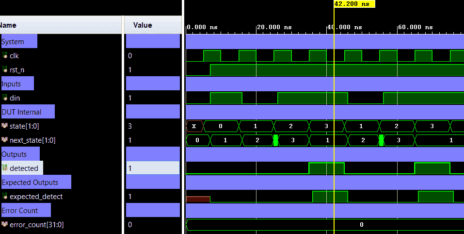

# FSM Sequence Detector (1011) — Mealy FSM with Overlap Detection


A synchronous **Mealy FSM** that detects the bit pattern `1011` on a serial input stream.
The output `detected` goes high for **exactly one clock cycle** when the pattern completes,
and **overlap is enabled** — the trailing `1` of one match can serve as the leading `1` of the next.
Verification uses a directed self-checking testbench (Verilog).

---

## 📋 Specification

| Property | Value |
|----------|-------|
| FSM type | Mealy |
| Target pattern | `1011` |
| Overlap | ✅ Enabled |
| Reset | Active-low synchronous (`rst_n`) |
| Output latency | Same cycle as the final bit |

---

## 🏗️ Architecture

### State Encoding

| State | Encoding | Meaning |
|-------|----------|---------|
| `S0` | `2'b00` | Idle — no prefix matched |
| `S1` | `2'b01` | Matched `1` |
| `S2` | `2'b10` | Matched `10` |
| `S3` | `2'b11` | Matched `101` |

### State-Transition Logic (Mealy)

| Current State | `din` | Next State | `detected` |
|---------------|-------|------------|-----------|
| S0 | 0 | S0 | 0 |
| S0 | 1 | S1 | 0 |
| S1 | 0 | S2 | 0 |
| S1 | 1 | S1 | 0 |
| S2 | 0 | S0 | 0 |
| S2 | 1 | S3 | 0 |
| S3 | 0 | S2 | 0 |
| S3 | 1 | **S1** | **1** |

> **Overlap**: on detection (`S3`, `din=1`), next state returns to `S1` (not `S0`),
> so the `1` is reused as the prefix of a new potential match.

### Top-level Block Diagram

```text
                  +---------------------------+
                  |  fsm_sequence_detector    |
                  |                           |
         clk ---->|                           |
                  |                           |
        rst_n --->|                           |----> detected
                  |                           |
         din ---->|                           |
                  |                           |
                  +---------------------------+
```

### Internal Architecture Diagram (ASCII)

```text
  +------------------------------------------------------------------------------+
  |                            fsm_sequence_detector                             |
  |                                                                              |
  |                +------------+                       +--------------------+   |
  |  clk --------->|   State    |   state               |  Next-State /      |   |
  |                |  Register  |---------------------->|  Output Logic      |   |
  |                |            |                       |                    |   |
  | rst_n -------->|            |<----------------------|                    |   |
  |                +------------+ next_state            |                    |   |
  |                                                     |                    |   |
  |  din --->-------------------------------------------|                    |   |
  |                                                     |                    |-----> detected
  |                                                     +--------------------+   |
  +------------------------------------------------------------------------------+
```

### State Transition Diagram

```text
  Mealy FSM — detect "1011" with overlap
  Arrow labels: din / detected


         0/0              1/0                     0/0
        (self)           (self)           +-----------------+
        +--+             +--+             |                 |
        v  |             v  |             v                 |
      +------+   1/0   +------+        +------+   1/0   +------+
 rst->|  S0  |-------->|  S1  |-----^  |  S2  |-------->|  S3  |
      | Idle |         | "1"  | 0/0    | "10" |         | "101"|
      +------+         +------+        +------+         +------+
         ^                 ^              |                 |
         |       0/0       |              |                 |
         +-----------------|--------------+                 |
                           |                                |
                           |      1/1 (DETECT!)             |
                           +--------------------------------+
                               (overlap: reuse "1")

  Bit stream example:
  din:      1  0  1  1  0  1  1  1
  state:   S0 S1 S2 S3 S1 S2 S3 S1  (after each posedge)
  detected: 0  0  0  1  0  0  1  0  (Mealy: output = f(state, din))
                        ^           ^
                    match #1     match #2 (overlap)
```

---

## 🔌 Port List / Interface

| Signal | Direction | Width | Description |
|--------|-----------|-------|-------------|
| `clk` | Input | 1 | Clock — rising-edge triggered |
| `rst_n` | Input | 1 | Active-low synchronous reset; drives FSM to `S0` |
| `din` | Input | 1 | Serial bit stream input |
| `detected` | Output | 1 | High for one cycle when pattern `1011` is matched |

---

## 🖥️ Simulation Results

Run simulation from either `sim/modelsim` or `sim/xsim` to view the waveform.



```text
=============================================================
=== fsm_sequence_detector_tb  |  Target sequence: "1011" ===
=============================================================
--- TC1: Basic stream 1-0-1-1-0-1-1-1 (overlap check) ------
  PASS  [01] t=8000  din=1  state=0  detected=0
  PASS  [02] t=17000  din=0  state=1  detected=0
  PASS  [03] t=27000  din=1  state=2  detected=0
  PASS  [04] t=37000  din=1  state=3  detected=1
  PASS  [05] t=47000  din=0  state=1  detected=0
  PASS  [06] t=57000  din=1  state=2  detected=0
  PASS  [07] t=67000  din=1  state=3  detected=1
  PASS  [08] t=77000  din=1  state=1  detected=0
--- TC2: All zeros 0-0-0-0 (no detect) --------------------
  PASS  [09] t=97000  din=0  state=0  detected=0
  PASS  [10] t=107000  din=0  state=0  detected=0
  PASS  [11] t=117000  din=0  state=0  detected=0
  PASS  [12] t=127000  din=0  state=0  detected=0
--- TC3: All ones 1-1-1-1 (no detect) ---------------------
  PASS  [13] t=147000  din=1  state=0  detected=0
  PASS  [14] t=157000  din=1  state=1  detected=0
  PASS  [15] t=167000  din=1  state=1  detected=0
  PASS  [16] t=177000  din=1  state=1  detected=0
--- TC4: Reset mid-sequence (1-0-1 | rst | 1-0-1-1) -------
  PASS  [17] t=197000  din=1  state=0  detected=0
  PASS  [18] t=207000  din=0  state=1  detected=0
  PASS  [19] t=217000  din=1  state=2  detected=0
  PASS  [20] t=237000  din=1  state=0  detected=0
  PASS  [21] t=247000  din=0  state=1  detected=0
  PASS  [22] t=257000  din=1  state=2  detected=0
  PASS  [23] t=267000  din=1  state=3  detected=1
--- TC5: False starts 1-0-1-0-1-0-1-1 (detect at end) -----
  PASS  [24] t=287000  din=1  state=0  detected=0
  PASS  [25] t=297000  din=0  state=1  detected=0
  PASS  [26] t=307000  din=1  state=2  detected=0
  PASS  [27] t=317000  din=0  state=3  detected=0
  PASS  [28] t=327000  din=1  state=2  detected=0
  PASS  [29] t=337000  din=0  state=3  detected=0
  PASS  [30] t=347000  din=1  state=2  detected=0
  PASS  [31] t=357000  din=1  state=3  detected=1
=============================================================
=== PASS: all 31 test vectors matched ===
=============================================================
```

---

## 🚀 How to Run

### Vivado xsim
```bash
cd sim/xsim && make sim

# Open waveform GUI view:
make gui

# Clean up simulation generated files:
make clean
```

### ModelSim / Questa
```bash
cd sim/modelsim && make sim

# Open waveform GUI view:
make gui

# Clean up simulation generated files:
make clean
```

### Portable Environment (Without Make)
```bash
# Vivado xsim
cd sim/xsim && xtclsh simulate.tcl

# ModelSim / Questa
cd sim/modelsim && vsim -c -do simulate.do
```

---

## ✅ Test Cases / Coverage

| # | Test | Input Sequence | Expected `detected` | Result |
|---|------|---------------|---------------------|--------|
| 1 | Overlapping matches | `1 0 1 1 0 1 1 1` | `0 0 0 1 0 0 1 0` | ✅ Pass |
| 2 | All zeros (no detect) | `0 0 0 0` | `0 0 0 0` | ✅ Pass |
| 3 | All ones (no detect) | `1 1 1 1` | `0 0 0 0` | ✅ Pass |
| 4 | Reset mid-sequence | `1 0 1` (rst) `1 0 1 1` | `0 0 0` (rst) `0 0 0 1` | ✅ Pass |
| 5 | False starts then detect | `1 0 1 0 1 0 1 1` | `0 0 0 0 0 0 0 1` | ✅ Pass |

**Coverage Summary:** 5 test cases, 31 vectors, all states & transitions covered via directed tests.

---

## 🐛 Bugs Found

| Bug ID | Description | Fixed |
|--------|-------------|-------|
| None | No bugs found in directed test | N/A |
