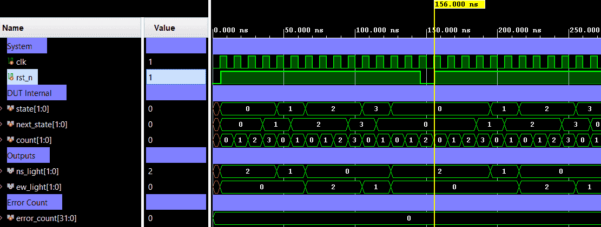

# FSM Traffic Light Controller — Parameterizable Two-Road Light Sequencer


A synchronous **Moore FSM** that controls traffic lights for two perpendicular roads:
**North–South (NS)** and **East–West (EW)**. The FSM cycles through four phases
(NS-Green → NS-Yellow → EW-Green → EW-Yellow) with parameterizable hold durations
for each phase. A built-in safety invariant guarantees both roads are never GREEN simultaneously.
Verification uses a directed self-checking testbench (Verilog).

---

## 📋 Specification

| Parameter | Default | Description |
|-----------|---------|-------------|
| `GREEN_CYCLES` | `4` | Number of clock cycles each GREEN phase lasts |
| `YELLOW_CYCLES` | `2` | Number of clock cycles each YELLOW phase lasts |

| Property | Value |
|----------|-------|
| FSM type | Moore |
| Reset | Active-low synchronous (`rst_n`) |
| Initial state | `NS_G` (NS road GREEN) |
| Safety invariant | NS and EW are **never** both GREEN |

### Light Encoding

| Colour    | `[1:0]` Value  |
|-----------|--------------- |
| 🔴 RED    | `2'b00`        |
| 🟡 YELLOW | `2'b01`        |
| 🟢 GREEN  | `2'b10`        |

---

## 🏗️ Architecture

### State Machine

| State   | Encoding | `ns_light` | `ew_light` | Duration | Next State  |
|---------|----------|------------|------------|----------|-------------|
| `NS_G`  | `2'b00`  | GREEN      | RED        | `GREEN_CYCLES` cycles  | `NS_Y` |
| `NS_Y`  | `2'b01`  | YELLOW     | RED        | `YELLOW_CYCLES` cycles | `EW_G` |
| `EW_G`  | `2'b10`  | RED        | GREEN      | `GREEN_CYCLES` cycles  | `EW_Y` |
| `EW_Y`  | `2'b11`  | RED        | YELLOW     | `YELLOW_CYCLES` cycles | `NS_G` |

### State-Transition Logic (Moore)

| Current State | Transition Condition (`count`) | Next State | `ns_light` | `ew_light` |
|---------------|--------------------------------|------------|------------|------------|
| `NS_G`        | `>= GREEN_CYCLES - 1`          | `NS_Y`     | `GREEN`    | `RED`      |
| `NS_Y`        | `>= YELLOW_CYCLES - 1`         | `EW_G`     | `YELLOW`   | `RED`      |
| `EW_G`        | `>= GREEN_CYCLES - 1`          | `EW_Y`     | `RED`      | `GREEN`    |
| `EW_Y`        | `>= YELLOW_CYCLES - 1`         | `NS_G`     | `RED`      | `YELLOW`   |

### Top-level Block Diagram

```text
                  +---------------------------+
                  |    fsm_traffic_light      |
                  |                           |
         clk ---->|                           |=====> ns_light[1:0]
                  |                           |
       rst_n ---->|                           |=====> ew_light[1:0]
                  |                           |
                  +---------------------------+
```

### Internal Architecture Diagram (ASCII)

```text
  +-------------------------------------------------------------------------------------+
  |                                 fsm_traffic_light                                   |
  |                                                                                     |
  |                +------------+                       +-------------------------+     |
  |  clk --------->|   State    |   state               |      Next-State         |     |
  |                |     &      |---------------------->|        Logic            |     |
  |                |  Counter   |                       |                         |     |
  | rst_n -------->| Registers  |<----------------------|                         |     |
  |                +------------+ next_state            +-------------------------+     |
  |                   |    |                                                            |
  |                   |    | count                      +-------------------------+     |
  |                   |    +--------------------------->|     Moore Output        |=============> ns_light[1:0]
  |                   |                                 |        Logic            |     |
  |                   +-------------------------------->|                         |=============> ew_light[1:0]
  |                         state                       +-------------------------+     |
  |                                                                                     |
  +-------------------------------------------------------------------------------------+

```

### State Transition Diagram

```text
  Moore FSM — Parameterized Traffic Light Controller
  Outputs (ns_light, ew_light) depend ONLY on Current State (Moore property).

  Notation:
    C_G : count == GREEN_CYCLES  - 1  (phase-end condition for GREEN  states)
    C_Y : count == YELLOW_CYCLES - 1  (phase-end condition for YELLOW states)
    !C_G / !C_Y : condition not yet met → FSM stays in current state (self-loop)

        !C_G             !C_Y             !C_G             !C_Y
       (self)           (self)           (self)           (self)
        +--+             +--+             +--+             +--+
        v  |             v  |             v  |             v  |
      +------+   C_G   +------+   C_Y   +------+   C_G   +------+
 rst->| NS_G |-------->| NS_Y |-------->| EW_G |-------->| EW_Y |
      |(G, R)|         |(Y, R)|         |(R, G)|         |(R, Y)|
      +------+         +------+         +------+         +------+
         ^                                                  |
         |                       C_Y                        |
         +--------------------------------------------------+

  Output Legend (ns_light, ew_light):
    (G, R)  NS_G  =>  ns_light = GREEN,   ew_light = RED
    (Y, R)  NS_Y  =>  ns_light = YELLOW,  ew_light = RED
    (R, G)  EW_G  =>  ns_light = RED,     ew_light = GREEN
    (R, Y)  EW_Y  =>  ns_light = RED,     ew_light = YELLOW
```

#### Timing Example (GREEN_CYCLES=4, YELLOW_CYCLES=2)

```text
  Cycle :   0     1     2     3     4     5     6     7     8     9    10    11
  State :  NS_G  NS_G  NS_G  NS_G  NS_Y  NS_Y  EW_G  EW_G  EW_G  EW_G  EW_Y  EW_Y
  Count :   0     1     2     3     0     1     0     1     2     3     0     1
  ns    :   G     G     G     G     Y     Y     R     R     R     R     R     R
  ew    :   R     R     R     R     R     R     G     G     G     G     Y     Y
```

---

## 🔌 Port List / Interface

| Signal | Direction | Width | Description |
|--------|-----------|-------|-------------|
| `clk` | Input | 1 | Clock — rising-edge triggered |
| `rst_n` | Input | 1 | Active-low synchronous reset; enters `NS_G`, `count=0` |
| `ns_light` | Output | 2 | North–South light code (see encoding table above) |
| `ew_light` | Output | 2 | East–West light code (see encoding table above) |

---

## 🖥️ Simulation Results

Run simulation from either `sim/modelsim` or `sim/xsim` to view the waveform.



```text
===========================================================
  fsm_traffic_light_tb  (GREEN=4, YELLOW=2)
===========================================================

--- TC1: Reset assertion ---
[PASS][TC1] After reset: ns=GREEN   ew=RED

--- TC2: Full cycle phase verification ---
[PASS][TC2]     NS_G cycle 0  t=6000  ns=GREEN   ew=RED
[PASS][TC2]     NS_G cycle 1  t=16000  ns=GREEN   ew=RED
[PASS][TC2]     NS_G cycle 2  t=26000  ns=GREEN   ew=RED
[PASS][TC2]     NS_G cycle 3  t=36000  ns=GREEN   ew=RED
[PASS][TC2]     NS_Y cycle 0  t=46000  ns=YELLOW  ew=RED
[PASS][TC2]     NS_Y cycle 1  t=56000  ns=YELLOW  ew=RED
[PASS][TC2]     EW_G cycle 0  t=66000  ns=RED     ew=GREEN
[PASS][TC2]     EW_G cycle 1  t=76000  ns=RED     ew=GREEN
[PASS][TC2]     EW_G cycle 2  t=86000  ns=RED     ew=GREEN
[PASS][TC2]     EW_G cycle 3  t=96000  ns=RED     ew=GREEN
[PASS][TC2]     EW_Y cycle 0  t=106000  ns=RED     ew=YELLOW
[PASS][TC2]     EW_Y cycle 1  t=116000  ns=RED     ew=YELLOW

--- TC4: Mid-run reset ---
[PASS][TC4] Mid-run reset: FSM correctly returned to NS_G  t=156000

--- TC5: Second full cycle after reset ---
[PASS][TC5]     NS_G cycle 0  t=156000  ns=GREEN   ew=RED
[PASS][TC5]     NS_G cycle 1  t=166000  ns=GREEN   ew=RED
[PASS][TC5]     NS_G cycle 2  t=176000  ns=GREEN   ew=RED
[PASS][TC5]     NS_G cycle 3  t=186000  ns=GREEN   ew=RED
[PASS][TC5]     NS_Y cycle 0  t=196000  ns=YELLOW  ew=RED
[PASS][TC5]     NS_Y cycle 1  t=206000  ns=YELLOW  ew=RED
[PASS][TC5]     EW_G cycle 0  t=216000  ns=RED     ew=GREEN
[PASS][TC5]     EW_G cycle 1  t=226000  ns=RED     ew=GREEN
[PASS][TC5]     EW_G cycle 2  t=236000  ns=RED     ew=GREEN
[PASS][TC5]     EW_G cycle 3  t=246000  ns=RED     ew=GREEN
[PASS][TC5]     EW_Y cycle 0  t=256000  ns=RED     ew=YELLOW
[PASS][TC5]     EW_Y cycle 1  t=266000  ns=RED     ew=YELLOW

===========================================================
  RESULT: PASS - all 5 test cases passed, 0 errors.
===========================================================
```

---

## 🚀 How to Run

### Vivado xsim
```bash
cd sim/xsim && make sim

# Open waveform GUI view:
make gui

# Clean up simulation generated files:
make clean
```

### ModelSim / Questa
```bash
cd sim/modelsim && make sim

# Open waveform GUI view:
make gui

# Clean up simulation generated files:
make clean
```

### Portable Environment (Without Make)
```bash
# Vivado xsim
cd sim/xsim && xtclsh simulate.tcl

# ModelSim / Questa
cd sim/modelsim && vsim -c -do simulate.do
```

---

## ✅ Test Cases / Coverage

| # | Test | Condition | Expected | Result |
|---|------|-----------|----------|--------|
| 1 | Safety invariant | All 20 cycles | NS and EW never both GREEN | ✅ Pass |
| 2 | NS-Green phase | Cycles 0–3 | `ns=GREEN`, `ew=RED` for 4 cycles | ✅ Pass |
| 3 | NS-Yellow phase | Cycles 4–5 | `ns=YELLOW`, `ew=RED` for 2 cycles | ✅ Pass |
| 4 | EW-Green phase | Cycles 6–9 | `ns=RED`, `ew=GREEN` for 4 cycles | ✅ Pass |
| 5 | EW-Yellow phase | Cycles 10–11 | `ns=RED`, `ew=YELLOW` for 2 cycles | ✅ Pass |
| 6 | Reset behavior | Assert `rst_n=0` → release | FSM enters `NS_G`, count=0 | ✅ Pass |

---

## 🐛 Bugs Found

| Bug ID | Description | Fixed |
|--------|-------------|-------|
| None | No bugs found in directed test | N/A |
