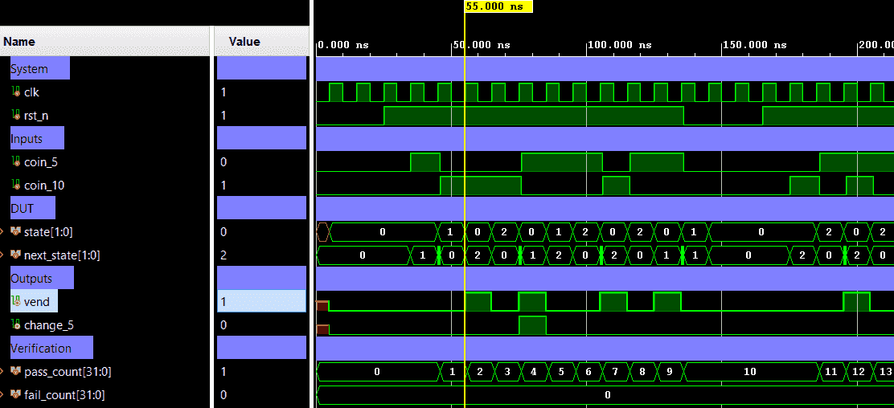

# FSM Vending Machine — Coin-Accumulating Dispense Controller


A synchronous **Mealy FSM** that models a simple vending machine accepting **5-unit** and **10-unit** coins.
The machine dispenses a product (price: **15 units**) via a `vend` pulse, and returns a 5-unit
change (`change_5`) when 20 units are inserted. Outputs are registered (appear on the clock cycle *after*
the transition that triggers them), making this a **pipelined Mealy** design.
Verification uses a directed self-checking testbench (Verilog).

---

## 📋 Specification

| Property | Value |
|----------|-------|
| Product price | 15 units |
| Accepted coins | 5 units (`coin_5`), 10 units (`coin_10`) |
| Dispense output | `vend` — 1-cycle registered pulse |
| Change output | `change_5` — 1-cycle pulse when 20 units inserted |
| Reset | Active-low synchronous (`rst_n`) |
| Output style | Registered (Mealy, 1-cycle pipeline delay after final coin) |
| Coin priority | `coin_10` takes priority if both inputs asserted simultaneously (caller must ensure mutual exclusion) |

---

## 🏗️ Architecture

### State Encoding

| State | Encoding | Accumulated Credit |
|-------|----------|--------------------|
| `S0` | `2'b00` | 0 units (idle) |
| `S5` | `2'b01` | 5 units |
| `S10` | `2'b10` | 10 units |

### Transition (Mealy)

| Current State | `coin_10` | `coin_5` | Next State | `vend_next` | `change_5_next` |
|---------------|-----------|----------|------------|-------------|-----------------|
| S0 | 0 | 0 | S0 | 0 | 0 |
| S0 | 0 | 1 | S5 | 0 | 0 |
| S0 | 1 | — | S10 | 0 | 0 |
| S5 | 0 | 0 | S5 | 0 | 0 |
| S5 | 0 | 1 | S10 | 0 | 0 |
| S5 | 1 | — | S0 | **1** | 0 |
| S10 | 0 | 0 | S10 | 0 | 0 |
| S10 | 0 | 1 | S0 | **1** | 0 |
| S10 | 1 | — | S0 | **1** | **1** |

> **Notes:**
> - `coin_10` takes priority over `coin_5` (— means don't-care).
> - `vend` and `change_5` are registered — they appear on the clock cycle **after** the transition that triggers them (`vend` ← `vend_next`).

### Valid Coin Sequences

| Sequence | Total | `vend` | `change_5` |
|----------|-------|--------|-----------|
| 5 → 10 | 15 | ✅ | ❌ |
| 10 → 5 | 15 | ✅ | ❌ |
| 5 → 5 → 5 | 15 | ✅ | ❌ |
| 10 → 10 | 20 | ✅ | ✅ |

### Top-level Block Diagram

```text
                +-----------------------------+
       clk ────►|     fsm_vending_machine     |
                |                             |
      rst_n ───►|                             |────► vend
                |                             |
     coin_5 ───►|                             |
                |                             |────► change_5
    coin_10 ───►|                             |
                +-----------------------------+
```

### Internal Architecture Diagram

```text
  +---------------------------------------------------------------------------------------------+
  |                                   fsm_vending_machine                                       |
  |                                                                                             |
  |                                                             +----------------------------+  |
  |                                                             |  Next-State / Output-Next  |  |
  |  coin_5  -------------------------------------------------->|                            |  |
  |                                                             |   (combinational Logic)    |  |
  |  coin_10 -------------------------------------------------->|                            |  |
  |                                                             |                            |  |
  |              +--------------------+  state                  |                            |  |
  |              |                    |------------------------>|                            |  |
  |              |                    |                         |                            |  |
  |              |                    |<------------------------|                            |  |
  |              |                    |  next_state/vend_next/  |                            |  |
  |              |                    |  change_5_next          +----------------------------+  |
  |  clk -------►|  State & Output    |                                                         |
  |              |     Register       |---------------------------------------------------------------------> vend
  |              |                    |                                                         |
  | rst_n ------►|                    |---------------------------------------------------------------------> change_5
  |              +--------------------+                                                         |
  |                                                                                             |
  +---------------------------------------------------------------------------------------------+

  Register pipeline (Mealy with registered outputs):
    Cycle N  : coin arrives → combinational logic computes vend_next, change_5_next, next_state
    Cycle N+1: state ← next_state  |  vend ← vend_next  |  change_5 ← change_5_next
```

### State Transition Diagram

```text
  Mealy FSM (registered outputs) — 3-state coin accumulator
  Arrow labels: input / registered output (appears NEXT cycle)
  Coins: c5 = coin_5 (5u),  c10 = coin_10 (10u)

          no coin (self-loop on all states)

               c10 (vend=0, chg=0)
          ┌──────────────────────────────┐
          │                              ▼
       +------+   c5   +------+   c5   +-------+
  rst─►|  S0  |───────►|  S5  |───────►|  S10  |
       | (0u) | vend=0 | (5u) | vend=0 | (10u) |
       +------+ chg=0  +------+ chg=0  +-------+
          ▲  ▲            │              │  │
          │  │    c10     │         c5   │  │ c10
          │  │  vend=1    │       vend=1 │  │ vend=1
          │  │  chg=0     │       chg=0  │  │ chg=1
          │  └────────────┘              │  │
          │                              ▼  ▼
          └──────────────────────────────┴──┘

                  (* outputs registered: appear on next clock cycle)

  State meanings:
    S0  (2'b00) : Idle          — 0 units accumulated
    S5  (2'b01) : Partial credit — 5 units accumulated
    S10 (2'b10) : Partial credit — 10 units accumulated

  Full transition summary:
    S0  + c10  ──►  S10  | vend=0, chg=0    (+10u, not yet 15u)
    S0  + c5   ──►  S5   | vend=0, chg=0    (+5u,  not yet 15u)
    S5  + c10  ──►  S0   | vend=1, chg=0    (5+10=15u, dispense)
    S5  + c5   ──►  S10  | vend=0, chg=0    (5+5=10u,  accumulate)
    S10 + c5   ──►  S0   | vend=1, chg=0    (10+5=15u, dispense)
    S10 + c10  ──►  S0   | vend=1, chg=1    (10+10=20u, dispense + change)

  Timing example — sequence c5 → c10 (15u, no change):

    Cycle:        1      2      3
    coin_5:       1      0      0
    coin_10:      0      1      0
    state:       S0     S5     S0
    vend:         0      0      1   ← registered: appears 1 cycle after transition
    change_5:     0      0      0
```


---

## 🔌 Port List / Interface

| Signal | Direction | Width | Description |
|--------|-----------|-------|-------------|
| `clk` | Input | 1 | Clock — rising-edge triggered |
| `rst_n` | Input | 1 | Active-low synchronous reset; drives FSM to `S0`, clears all outputs |
| `coin_5` | Input | 1 | Insert 5-unit coin (1-cycle pulse, mutually exclusive with `coin_10`) |
| `coin_10` | Input | 1 | Insert 10-unit coin (1-cycle pulse; takes priority if both asserted) |
| `vend` | Output | 1 | Registered dispense pulse — high for one cycle after threshold reached |
| `change_5` | Output | 1 | Registered change pulse — high for one cycle when 5 units returned |

---

## 🖥️ Simulation Results

Run simulation from either `sim/modelsim` or `sim/xsim` to view the waveform.



```text
=========================================================
===  fsm_vending_machine_tb ===
=========================================================
---------------------------------------------------------
  TC1: 5u + 10u = 15u -> vend=1, change=0
---------------------------------------------------------
[PASS] TC1_c5    t=46000 ns | c5=1 c10=0 | vend=0 chg=0
[PASS] TC1_c10   t=56000 ns | c5=0 c10=1 | vend=1 chg=0
---------------------------------------------------------
  TC2: 10u + 10u = 20u -> vend=1, change=1
---------------------------------------------------------
[PASS] TC2_c10   t=66000 ns | c5=0 c10=1 | vend=0 chg=0
[PASS] TC2_c10b  t=76000 ns | c5=0 c10=1 | vend=1 chg=1
---------------------------------------------------------
  TC3: 5u + 5u + 5u = 15u -> vend=1, change=0
---------------------------------------------------------
[PASS] TC3_c5a   t=86000 ns | c5=1 c10=0 | vend=0 chg=0
[PASS] TC3_c5b   t=96000 ns | c5=1 c10=0 | vend=0 chg=0
[PASS] TC3_c5c   t=106000 ns | c5=1 c10=0 | vend=1 chg=0
---------------------------------------------------------
  TC4: 10u + 5u = 15u -> vend=1, change=0
---------------------------------------------------------
[PASS] TC4_c10   t=116000 ns | c5=0 c10=1 | vend=0 chg=0
[PASS] TC4_c5    t=126000 ns | c5=1 c10=0 | vend=1 chg=0
---------------------------------------------------------
  TC5: Mid-sequence reset recovery
---------------------------------------------------------
[PASS] TC5_c5    t=136000 ns | c5=1 c10=0 | vend=0 chg=0
        [INFO] Asserting reset mid-sequence...
[PASS] TC5_rst   t=186000 ns | c5=0 c10=1 | vend=0 chg=0
[PASS] TC5_disc  t=196000 ns | c5=1 c10=0 | vend=1 chg=0
---------------------------------------------------------
  TC6: coin_5 & coin_10 simultaneously (coin_10 priority)
---------------------------------------------------------
[PASS] TC6_both  t=206000 ns | c5=1 c10=1 | vend=0 chg=0
[PASS] TC6_disc  t=216000 ns | c5=1 c10=0 | vend=1 chg=0
=========================================================
  Results: 14 PASSED, 0 FAILED
  STATUS : ** ALL TESTS PASSED **
=========================================================
```

---

## 🚀 How to Run

### Vivado xsim
```bash
cd sim/xsim && make sim

# Open waveform GUI view:
make gui

# Clean up simulation generated files:
make clean
```

### ModelSim / Questa
```bash
cd sim/modelsim && make sim

# Open waveform GUI view:
make gui

# Clean up simulation generated files:
make clean
```

### Portable Environment (Without Make)
```bash
# Vivado xsim
cd sim/xsim && xtclsh simulate.tcl

# ModelSim / Questa
cd sim/modelsim && vsim -c -do simulate.do
```

---

## ✅ Test Cases / Coverage

| # | Test | Coin Sequence | Expected | Result |
|---|------|--------------|----------|--------|
| 1 | Exact 15 via 5+10 | `coin_5` → `coin_10` | `vend=1`, `change_5=0` | ✅ Pass |
| 2 | Exact 20 via 10+10 | `coin_10` → `coin_10` | `vend=1`, `change_5=1` | ✅ Pass |
| 3 | Exact 15 via 5+5+5 | `coin_5` × 3 | `vend=1`, `change_5=0` | ✅ Pass |
| 4 | Idle (no coin) | No input | `vend=0`, `change_5=0` | ✅ Pass |
| 5 | Reset mid-sequence | Insert `coin_5`, assert `rst_n=0` | Credit clears, all outputs deassert | ✅ Pass |

---

## 🐛 Known Limitations / Assumptions

| # | Description |
|---|-------------|
| 1 | Simultaneous `coin_5` and `coin_10` assertion is an **invalid input condition** — `coin_10` takes priority per design intent; caller must ensure mutual exclusion. |
| 2 | No timeout/abort mechanism — credit accumulates indefinitely until a vend threshold is reached or reset is asserted. |
