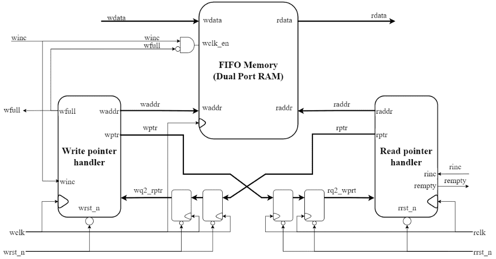
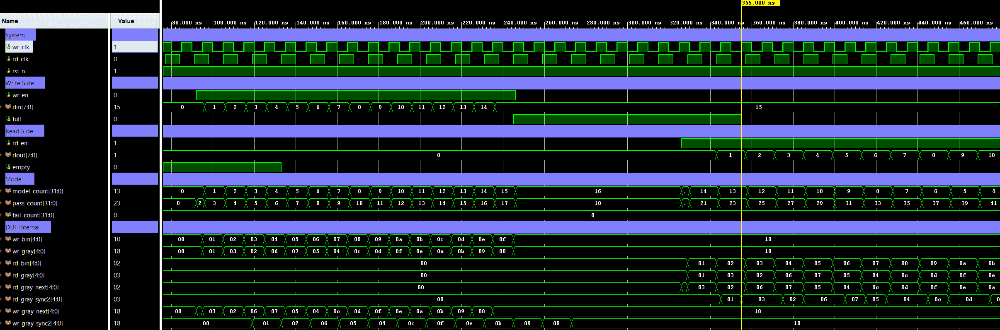

# Async FIFO — Dual-Clock First-In-First-Out Buffer


A dual-clock **asynchronous FIFO** built with **Gray-code pointers** and **2-FF synchronizers**
for safe clock-domain-crossing (CDC) pointer transfer.
The `full` flag is generated in the **write domain**; the `empty` flag is generated in the **read domain**.
Verification uses a directed + random-stress self-checking testbench with a reference ring-buffer model.

> 📖 **Read more:** Explanation and examples of the algorithm are available at [asyn_fifo_theory.md](../../docs/asyn_fifo_theory.md)


---

## 📋 Specification

| Property | Value |
|----------|-------|
| Depth | `2^ADDR_WIDTH` entries (default: 16) |
| Data width | `DATA_WIDTH` bits (default: 8) |
| Pointer width | `ADDR_WIDTH + 1` bits (extra MSB for full/empty distinguish) |
| Reset | Active-low asynchronous (`rst_n`) — both domains |
| `full` domain | Write clock (`wr_clk`) |
| `empty` domain | Read clock (`rd_clk`) |
| CDC method | Gray-code pointer + 2-FF synchronizer (Cummings method) |
| Output style | `dout` is registered — data appears on the clock cycle *after* `rd_en` is asserted |

---

## 🏗️ Architecture

### Parameters

| Parameter | Default | Description |
|-----------|---------|-------------|
| `DATA_WIDTH` | 8 | Data width in bits |
| `ADDR_WIDTH` | 4 | Address width; FIFO depth = `2^ADDR_WIDTH` |

### Full / Empty Detection (Cummings Method)

| Signal | Domain | Logic |
|--------|--------|-------|
| `full_next` | Write | `wr_gray_next == { ~rd_gray_sync2[MSB:MSB-1], rd_gray_sync2[MSB-2:0] }` |
| `empty_next` | Read | `rd_gray_next == wr_gray_sync2` |

> **Notes:**
> - `full` is detected when the two **MSBs differ** but the remaining bits match — indicating the write pointer has lapped the read pointer.
> - `empty` is detected when the synchronized write pointer equals the read pointer (all bits identical).

### Top-Level Block Diagram

```text
             +----------------------------------+
             |            async_fifo            |
             |                                  |
  wr_clk  ──►| [WRITE DOMAIN]                   |
   wr_en  ──►|                                  |───> full
   din    ──►|                                  |
             |                                  |
             |                   [READ DOMAIN]  |
  rd_clk  ──►|                                  |───> dout
   rd_en  ──►|                                  |───> empty
             |                                  |
   rst_n ───►| [COMMON]                         |
             +----------------------------------+

```


### Internal Architecture Diagram

```text
            wr_clk   rst_n                                               rd_clk   rst_n
              |        |                                                   |        |
              v        v                                                   v        v
+----------------------------------------------------------------------------------------------------+
|                                            async_fifo                                              |
|                                                                                                    |
|           [WRITE DOMAIN]                                                [READ DOMAIN]              |
|                                                                                                    |
|                                     +-----------------------+                   rd_en              |
|                                     |      MEMORY (mem)     |                     |                |
|                                     v                       v                     v                |
|                                   +---+                   +---+                                    |
|                                   | W |                   | R |                                    |
| din ----------------------------> | R |                   | E |-------------------------------------> dout
|                                   | I |                   | A |                                    |
|          +------------+  wr_addr  | T |                   | D |  rd_addr  +------------+           |
| wr_en -->| wr_bin_reg |---------->| E |                   |   |<----------| rd_bin_reg |<--- rd_en |
|          +------------+           |   |                   |   |           +------------+           |
|                |                  | P |                   | P |                  |                 |
|                v                  | O |                   | O |                  v                 |
|          +------------+           | R |                   | R |           +------------+           |
|          |  bin2gray  |           | T |                   | T |           |  bin2gray  |           |
|          +------------+           +---+                   +---+           +------------+           |
|                |                                                                 |                 |
|                v                                                                 v                 |
|          +------------+                                                   +------------+           |
|          | wr_gray_reg|                                                   | rd_gray_reg|           |
|          +------------+                                                   +------------+           |
|              |   |                                                               |   |             |
|              |   | wr_gray_next                                     rd_gray_next |   |             |
|              |   +----------------------+                    +-------------------+   |             |
|              |                          |                    |                       |             |
|              | wr_gray                  v                    v               rd_gray |             |
|              |                    +-----------+        +-----------+                 |             |
|              |               +--->|   Full    |        |   Empty   |<---+            |             |
|              |               |    |   Logic   |        |   Logic   |    |            |             |
|              |               |    +-----------+        +-----------+    |            |             |
|              |               |          |                    |          |            |             |
|              |               |          v                    v          |            |             |
|              |               |        full                 empty        |            |             |
|              |               |                                          |            |             |
|              |               |    +-----------+        +-----------+    |            |             |
|              |               +----| rd_gray_  |        | wr_gray_  |----+            |             |
|              |                    | sync(2FF) |        | sync(2FF) |                 |             |
|              |                    +-----------+        +-----------+                 |             |
|              |                          ^                    ^                       |             |
|              |                          |                    |                       |             |
|              +--------------------------|--------------------+                       |             |
|                                         |                                            |             |
|                                         +--------------------------------------------+             |
|                                                                                                    |
+----------------------------------------------------------------------------------------------------+

  CDC pointer crossing:
    Cycle N   : wr_gray captured
    Cycle N+1 : wr_gray_sync1 ← wr_gray        (1st FF, read domain)
    Cycle N+2 : wr_gray_sync2 ← wr_gray_sync1  (2nd FF, metastability resolved)
    Cycle N+2 : empty evaluated using wr_gray_sync2
```

### Reference Architecture Diagram

Below is the visual representation of the Async FIFO architecture, highlighting the clock domains, memory array, Gray-code pointer conversions, and the 2-stage Flip-Flop synchronizers:

> *Reference: Architecture diagram adapted from [ujjwal-2001/Async_FIFO_Design](https://github.com/ujjwal-2001/Async_FIFO_Design).*

<p align="center">
  
</p>

### CDC Timing Diagram

```text
  Write domain                   Read domain
  ──────────────                 ──────────────────────────────────────────
  wr_clk  ┐ ┌─┐ ┌─┐ ┌─┐         rd_clk  ┐  ┌──┐  ┌──┐  ┌──┐  ┌──┐  ┌──┐  ┌──┐  ┌──┐
          └─┘ └─┘ └─┘                   └──┘  └──┘  └──┘  └──┘  └──┘  └──┘  └──┘  └──┘

  wr_gray ──[VALID]───────────────────────────────────────────────────────►
                                 wr_gray_sync1       xxxxxx──[VALID]───────►
                                 wr_gray_sync2             xxxxxx──[VALID]───►
                                 empty_next                         evaluated
                                                            |← 2 rd_clk cycles →|

  Gray encoding guarantees only 1 bit changes per transition →
  even if synchronizer samples at a glitch boundary, the worst
  case is off-by-one.
```

---

## 🔌 Port List / Interface

| Signal | Direction | Width | Description |
|--------|-----------|-------|-------------|
| `wr_clk` | Input | 1 | Write clock domain |
| `rd_clk` | Input | 1 | Read clock domain |
| `rst_n` | Input | 1 | Active-low asynchronous reset (both domains) |
| `wr_en` | Input | 1 | Write enable — effective only when `full = 0` |
| `rd_en` | Input | 1 | Read enable — effective only when `empty = 0` |
| `din` | Input | `DATA_WIDTH` | Write data input |
| `dout` | Output | `DATA_WIDTH` | Read data output (registered — valid 1 cycle after `rd_en`) |
| `full` | Output | 1 | FIFO full flag (write clock domain) |
| `empty` | Output | 1 | FIFO empty flag (read clock domain) |

---

## 🖥️ Simulation Results

Run simulation from either `sim/modelsim` or `sim/xsim` to view the waveform.



```text
=== async_fifo Testbench (directed + stress) ===
[0] PASS: FIFO is empty after reset
[0] PASS: FIFO is not full after reset
[11] PASS: Model count within FIFO depth after write
...
[xxx] PASS: Read data matches FIFO order (0x00)
[xxx] PASS: Model count non-negative after read
...
[xxx] PASS: Full flag asserts after filling FIFO
[xxx] PASS: Empty flag asserts after draining FIFO
... (stress: 50 random write/read iterations) ...
[xxx] PASS: Model FIFO is empty at end of test
-----------------------------------------------
=== PASS: all 140 checks passed ===
```

---

## 🚀 How to Run

### Vivado xsim
```bash
cd sim/xsim && make sim

# Open waveform GUI view:
make gui

# Clean up simulation generated files:
make clean
```

### ModelSim / Questa
```bash
cd sim/modelsim && make sim

# Open waveform GUI view:
make gui

# Clean up simulation generated files:
make clean
```

### Portable Environment (Without Make)
```bash
# Vivado xsim
cd sim/xsim && xtclsh simulate.tcl

# ModelSim / Questa
cd sim/modelsim && vsim -c -do simulate.do
```

---

## ✅ Test Cases / Coverage

| # | Test | Condition | Expected | Result |
|---|------|-----------|----------|--------|
| 1 | Reset behavior | Release `rst_n` after 4 write+read clocks | `empty=1`, `full=0` | ✅ Pass |
| 2 | Fill to full | Write `DEPTH` (16) entries consecutively | `full` asserts | ✅ Pass |
| 3 | Drain to empty | Read back all `DEPTH` entries | Data order preserved, `empty` asserts | ✅ Pass |
| 4 | Data integrity | Compare each `dout` against reference ring-buffer | No data mismatch | ✅ Pass |
| 5 | Random stress | 50 iterations of random write/read mix, async clocks | `model_count` always valid, no mismatch | ✅ Pass |
| 6 | Write-when-full guard | `wr_en` asserted while `full=1` | No write occurs, data not corrupted | ✅ Pass (via `wr_fire`) |
| 7 | Read-when-empty guard | `rd_en` asserted while `empty=1` | No read occurs, `dout` unchanged | ✅ Pass (via `rd_fire`) |

---

## 🐛 Known Limitations / Assumptions

| # | Description |
|---|-------------|
| 1 | **Single shared `rst_n`** — both clock domains share one active-low asynchronous reset. In a strict two-domain design, each domain should have its own synchronized deassertion. |
| 2 | **No almost-full / almost-empty flags** — only binary `full` / `empty` are generated. Programmable thresholds are not implemented. |
| 3 | **Synchronous read output** — `dout` is registered. The data appears on the clock edge *after* `rd_en` is asserted (1-cycle read latency). |
| 4 | **Power-of-2 depth only** — `ADDR_WIDTH` must be a positive integer; non-power-of-2 depths are not supported. |
