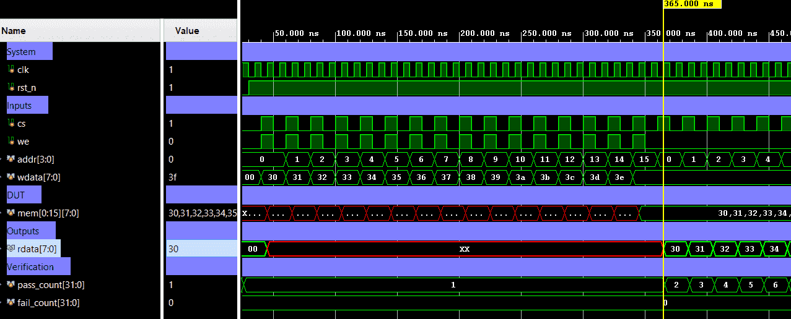

# Single-Port SRAM - Synchronous 1RW Memory


A parameterized **single-port synchronous SRAM** with one shared read/write
address port, chip select, write enable, and registered read data.
The model uses **read-first** behavior: during a write cycle, `rdata` captures
the old memory contents at `addr`, while `wdata` is committed into memory for
later reads.

Verification uses a directed + random self-checking testbench with a reference
memory model.

---

## Specification

| Property | Value |
|----------|-------|
| Depth | `2^ADDR_WIDTH` entries (default: 16) |
| Data width | `DATA_WIDTH` bits (default: 8) |
| Ports | 1 shared read/write port |
| Read timing | Synchronous, registered output |
| Write timing | Synchronous on `posedge clk` |
| Reset | Active-low synchronous reset for `rdata` only |
| Chip select | `cs=0` holds `rdata` and disables memory access |
| Same-address write/read | Read-first: old data appears on `rdata` |

---

## Architecture

### Parameters

| Parameter | Default | Description |
|-----------|---------|-------------|
| `DATA_WIDTH` | 8 | Data width in bits |
| `ADDR_WIDTH` | 4 | Address width; SRAM depth = `2^ADDR_WIDTH` |

### Behavior

| `rst_n` | `cs` | `we` | Operation |
|---------|------|------|-----------|
| 0 | X | X | Clear registered `rdata` to zero |
| 1 | 0 | X | Hold registered `rdata`; memory unchanged |
| 1 | 1 | 0 | Read `mem[addr]` into `rdata` |
| 1 | 1 | 1 | Read old `mem[addr]` into `rdata`, then write `wdata` to `mem[addr]` |

> Memory contents are not reset. This matches common SRAM macro behavior where
> only external state/control is reset, while the array contents are initialized
> by software or explicit writes.

### Top-Level Block Diagram

```text
             +----------------------------------+
             |        single_port_sram          |
             |                                  |
 clk   ----->| synchronous control              |
 rst_n ----->|                                  |
 cs    ----->| enable                           |
 we    ----->| 1=write, 0=read                  |
 addr  ----->| shared address                   |
 wdata ----->| write data                       |
             |                                  |
             | registered read data             |----> rdata
             +----------------------------------+
```

### Internal Architecture Diagram

```text
                       clk
                        |
                        v
              +-------------------+
 cs --------->| access qualifier  |
 we --------->| read/write select |
              +---------+---------+
                        |
                        v
                 +-------------+
 addr ---------->| SRAM array  |
 wdata --------->| DEPTH x DW  |
                 +------+------+
                        |
                        v
                 +-------------+
 rst_n --------->| rdata reg   |----> rdata
                 +-------------+
```

---

## Port List / Interface

| Signal | Direction | Width | Description |
|--------|-----------|-------|-------------|
| `clk` | Input | 1 | Clock |
| `rst_n` | Input | 1 | Active-low synchronous reset for `rdata` |
| `cs` | Input | 1 | Chip select / memory enable |
| `we` | Input | 1 | Write enable (`1=write`, `0=read`) |
| `addr` | Input | `ADDR_WIDTH` | Shared read/write address |
| `wdata` | Input | `DATA_WIDTH` | Write data |
| `rdata` | Output | `DATA_WIDTH` | Registered read data |

---

## Simulation Results

Run simulation from either `sim/modelsim` or `sim/xsim` to view the waveform.



```text
=== single_port_sram Testbench (directed + random self-check) ===

--- TC1: Reset behavior ---
[26000] PASS: Read data register clears during reset

--- TC2: Directed write/read sweep ---
[366000] PASS: Directed read matches reference model -- addr=0 rdata=0x30
...
[666000] PASS: Directed read matches reference model -- addr=15 rdata=0x3f

--- TC3: Overwrite selected addresses ---
[686000] PASS: Write cycle returns old data at addressed location
[706000] PASS: Write cycle returns old data at addressed location
[726000] PASS: Overwrite updates address 3 -- addr=3 rdata=0xa5
[746000] PASS: Overwrite updates address 12 -- addr=12 rdata=0x5a
[766000] PASS: Neighbor address remains unchanged -- addr=4 rdata=0x34

--- TC4: Chip-select hold behavior ---
[786000] PASS: Chip-select low holds registered read data
[806000] PASS: Chip-select disabled write did not update memory -- addr=15 rdata=0x3f

--- TC5: Read-first write/read same address policy ---
[826000] PASS: Write cycle returns old data at addressed location
[846000] PASS: New data is visible after read-first write commits -- addr=3 rdata=0xc3

--- TC6: Random write/read stress ---
[866000] PASS: Write cycle returns old data at addressed location
...
[1646000] PASS: Random write/read matches reference model -- addr=13 rdata=0x53
-----------------------------------------------
=== PASS: all 66 checks passed ===
```

---

## How to Run

### Vivado xsim

```bash
cd sim/xsim && make sim

# Open waveform GUI view:
make gui

# Clean up simulation generated files:
make clean
```

### ModelSim / Questa

```bash
cd sim/modelsim && make sim

# Open waveform GUI view:
make gui

# Clean up simulation generated files:
make clean
```

### Portable Environment (Without Make)

```bash
# Vivado xsim
cd sim/xsim && xtclsh simulate.tcl

# ModelSim / Questa
cd sim/modelsim && vsim -c -do simulate.do
```

---

## Test Cases / Coverage

| # | Test | Condition | Expected | Result |
|---|------|-----------|----------|--------|
| 1 | Reset behavior | Assert `rst_n=0` for multiple clocks | `rdata=0` | Pass |
| 2 | Directed write sweep | Write all `DEPTH` addresses | Each write returns old data | Pass |
| 3 | Directed read sweep | Read all `DEPTH` addresses | Data matches reference model | Pass |
| 4 | Overwrite | Update selected addresses | New data visible on later reads | Pass |
| 5 | Neighbor protection | Overwrite one address | Adjacent address remains unchanged | Pass |
| 6 | Chip-select hold | Toggle write controls with `cs=0` | `rdata` and memory remain unchanged | Pass |
| 7 | Read-first policy | Write then read same address | Write cycle returns old data; next read returns new data | Pass |
| 8 | Random stress | 20 random write/read pairs | No model mismatch | Pass |

---

## Known Limitations / Assumptions

| # | Description |
|---|-------------|
| 1 | Memory array contents are not reset by `rst_n`; only `rdata` is reset. |
| 2 | This is a behavioral SRAM model for RTL simulation/synthesis inference, not a foundry-specific SRAM macro wrapper. |
| 3 | `ADDR_WIDTH` is expected to be a positive integer; depth is power-of-2 only. |
