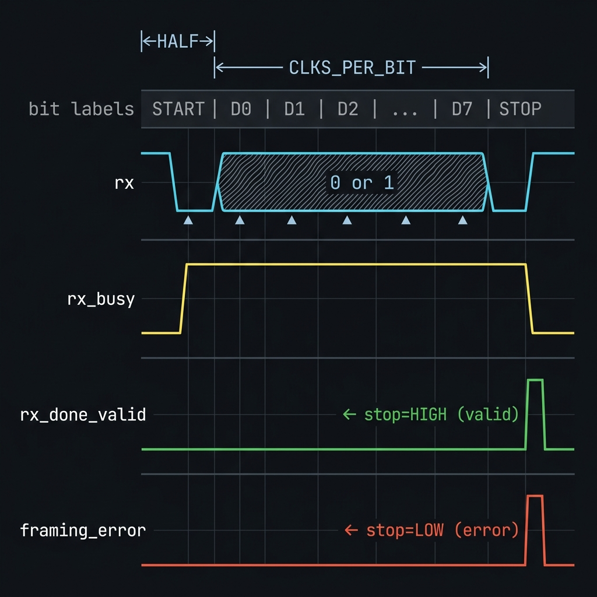

# UART Receiver — 8N1 Serial Interface


A parameterized, fully synthesizable UART receiver implementing the **8N1** frame format
(1 start bit, 8 data bits LSB-first, 1 stop bit). The module synchronizes the asynchronous
serial input through a two flip-flop metastability chain, validates the start bit at its center,
samples eight data bits, and validates the stop bit. Valid frames update `data_out` and assert a
one-clock `rx_done_valid` pulse; a low stop bit triggers a one-clock `framing_error` pulse instead.

> 📖 For full UART protocol background, see [`docs/uart_theory.md`](../../docs/uart_theory.md)
> (idle state, 8N1 frame structure, baud rate tolerance, framing/overrun/parity errors).

---

## 📋 Specification

| Property | Value |
|---|---|
| Frame format | 8N1 — 8 data bits, no parity, 1 stop bit |
| Bit order | LSB (D0) first |
| Idle level | Logic HIGH |
| Start bit | Logic LOW — 1 bit period |
| Stop bit | Logic HIGH — 1 bit period |
| Reset style | Active-low synchronous |
| Input synchronization | Two flip-flop metastability chain |
| Sampling | Center of start, data, and stop bits |
| Valid indication | `rx_done_valid` — one system-clock pulse when `data_out` is updated |
| Error indication | `framing_error` — one system-clock pulse when stop bit is LOW |
| Error recovery | Wait for RX to return HIGH before accepting a new start |

---

## 🏗️ Architecture

### Parameters

| Parameter | Default | Description |
|---|---:|---|
| `CLK_FREQ_HZ` | `50_000_000` | System clock frequency in Hz |
| `BAUD_RATE` | `115_200` | Target UART baud rate in bps |

The baud divisor is computed at elaboration time with round-to-nearest division:

```verilog
localparam integer CLKS_PER_BIT = (CLK_FREQ_HZ + (BAUD_RATE / 2)) / BAUD_RATE;
```

The transmitter and receiver must use compatible baud rates. Eight or more system clocks per UART
bit is recommended to maintain useful sampling margin.

### FSM State Machine

| State | Purpose | Exit Condition |
|---|---|---|
| `IDLE` | Wait for synchronized RX LOW | Possible start detected |
| `START` | Validate LOW at the start-bit center | Valid start → `DATA`; false start → `IDLE` |
| `DATA` | Sample D0 through D7 at bit centers | Eight data samples complete |
| `STOP` | Sample and validate stop bit | Valid byte → `IDLE` (`rx_done_valid`); bad stop → `WAIT_IDLE` (`framing_error`) |
| `WAIT_IDLE` | Suppress retrigger after a bad stop or break | RX returns HIGH → `IDLE` |

### Top-Level Block Diagram

```text
                +--------------------+
   clk  ───────►|                    |
  rst_n ───────►|      uart_rx       |────► data_out[7:0]
    rx  ───────►|                    |────► rx_busy
                |  [CLK_FREQ_HZ]     |────► rx_done_valid
                |  [BAUD_RATE]       |────► framing_error
                +--------------------+
```

---

## 🔌 Port List / Interface

| Signal | Dir | Width | Active | Description |
|---|---|---:|---|---|
| `clk` | In | 1 | Rising edge | System clock |
| `rst_n` | In | 1 | LOW | Active-low synchronous reset |
| `rx` | In | 1 | — | Asynchronous UART serial input; HIGH while idle |
| `data_out` | Out | 8 | — | Last correctly received byte; persistent until next valid frame |
| `rx_busy` | Out | 1 | HIGH | Asserted while validating start or receiving a frame |
| `rx_done_valid` | Out | 1 | HIGH | Single-clock pulse when `data_out` is updated |
| `framing_error` | Out | 1 | HIGH | Single-clock pulse when the sampled stop bit is LOW |

**Signal timing notes:**
- `data_out` is persistent — it changes only after a complete valid frame; use `rx_done_valid` as the byte-accept strobe.
- `rx_done_valid` and `framing_error` are mutually exclusive for any completed frame.
- Both `rx_done_valid` and `framing_error` default LOW every clock and remain asserted for **one clock only**.
- A false start (short LOW glitch) leaves `data_out`, `rx_done_valid`, and `framing_error` all unchanged.

### Receive Frame Waveform




---

## 🖥️ Simulation Results

Run simulation from either `sim/modelsim` or `sim/xsim` to view the waveform.

```text
=== uart_rx Testbench (directed self-check) ===

--- TC1: Reset and idle behavior ---
[36000] PASS: Reset restores receiver outputs
[306000] PASS: Idle-high line does not start a frame

--- TC2: Alternating and boundary patterns ---
[1146000] PASS: 0x55 decoded correctly
[1986000] PASS: 0xA3 decoded correctly
[2826000] PASS: 0x00 (all-zero) decoded correctly
[3666000] PASS: 0xFF (all-one) decoded correctly

--- TC3: Back-to-back frames ---
[4465000] PASS: Frame 1 (0x3C) decoded correctly
[5306000] PASS: Frame 2 (0xC3) decoded correctly
[5306000] PASS: Two back-to-back frames produce two rx_done_valid pulses
[5306000] PASS: Receiver is idle after back-to-back frames

--- TC4: False-start rejection ---
[5486000] PASS: Short LOW pulse rejected; no rx_done_valid asserted
[5486000] PASS: False start does not overwrite data_out
[5486000] PASS: False start returns receiver to idle without an error

--- TC5: Framing-error detection and recovery ---
[6326000] PASS: Low stop bit triggers framing_error
[6326000] PASS: data_out preserved after framing error
[7166000] PASS: Valid frame creates one rx_done_valid pulse
[7166000] PASS: Valid frame does not create framing_error
[7166000] PASS: Receiver returns to idle after valid frame
[7166000] PASS: Receiver recovers and accepts next valid frame

--- TC6: Noise after center sample is tolerated ---
[8006000] PASS: Noise after center sample does not corrupt data

--- TC7: Reset aborts an active frame ---
[8186000] PASS: Reset aborts an active receive operation
[9056000] PASS: Valid frame creates one rx_done_valid pulse
[9056000] PASS: Valid frame does not create framing_error
[9056000] PASS: Receiver returns to idle after valid frame
[9056000] PASS: Receiver accepts a new frame after reset abort
-----------------------------------------------
=== PASS: 7 TCs, all 37 checks passed ===
```

---

## 🚀 How to Run

### Vivado xsim

```bash
cd sim/xsim && make sim

# Open waveform GUI view:
make gui

# Clean up simulation generated files:
make clean
```

### ModelSim / Questa

```bash
cd sim/modelsim && make sim

# Open waveform GUI view:
make gui

# Clean up simulation generated files:
make clean
```

### Portable Environment (Without Make)

```bash
# Vivado xsim
cd sim/xsim && xtclsh simulate.tcl

# ModelSim / Questa
cd sim/modelsim && vsim -c -do simulate.do
```

---

## ✅ Test Cases / Coverage

| # | Test | Condition | Expected | Result |
|---|---|---|---|---|
| 1 | Reset & idle | Assert `rst_n=0`, release | `data_out=0x00`, `rx_done_valid=0`, `framing_error=0` | ✅ Pass |
| 2 | Standard frames | `0x55`, `0xA3`, `0x00`, `0xFF` | All 8 bits match; `rx_done_valid` pulses once per frame | ✅ Pass |
| 3 | Contiguous frames | Two frames, no idle gap beyond stop bit | Both frames decoded correctly | ✅ Pass |
| 4 | False start rejection | Short LOW pulse < half bit period | No `rx_done_valid`; `data_out` unchanged | ✅ Pass |
| 5 | Framing error | LOW stop bit | `framing_error` pulses; `data_out` preserved; FSM recovers | ✅ Pass |
| 6 | Late-edge noise | Noise injected after bit-center sample | Sampled data unaffected | ✅ Pass |
| 7 | Reset during frame | Assert `rst_n=0` mid-reception | FSM returns to IDLE cleanly; new frame succeeds | ✅ Pass |

Detailed verification intent is recorded in [docs/test_plan.md](docs/test_plan.md).

---

## ⚙️ Baud Rate Reference

| `CLK_FREQ_HZ` | `BAUD_RATE` | `CLKS_PER_BIT` | Error |
|---|---|---|---|
| 50 000 000 | 115 200 | 434 | +0.006 % ✅ |
| 50 000 000 | 9 600 | 5 208 | +0.006 % ✅ |
| 100 000 000 | 115 200 | 868 | +0.006 % ✅ |
| 12 000 000 | 115 200 | 104 | +0.160 % ✅ |
| 8 000 000 | 1 000 000 | 8 | 0.000 % ✅ |

> Baud error below **±2 %** is universally accepted; above ±5 % causes framing errors.
> Select parameters that produce **at least 8 system clocks per UART bit** for useful sampling margin.

---

## 🔗 Integration Example

```verilog
uart_rx #(
    .CLK_FREQ_HZ (50_000_000),
    .BAUD_RATE   (115_200)
) u_uart_rx (
    .clk           (sys_clk),
    .rst_n         (sys_rst_n),
    .rx            (uart_rxd),
    .data_out      (received_byte),
    .rx_busy       (uart_rx_busy),
    .rx_done_valid  (received_byte_valid),
    .framing_error (uart_frame_error)
);
```

Use the same `CLK_FREQ_HZ` and `BAUD_RATE` parameters as `uart_tx` when both modules form a
local UART controller. `rx_done_valid` can drive the write-enable of a receive FIFO directly.

---

## ⚠️ Known Limitations

| # | Limitation | Suggested Extension |
|---:|---|---|
| 1 | Frame format is fixed at 8N1 | Parameterize data width, parity, and stop bits |
| 2 | No receive FIFO | Add a FIFO before software or slower downstream logic |
| 3 | One center sample per bit | Add 8× or 16× oversampling with majority voting |
| 4 | Only framing errors are reported | Add parity, overrun, and break indicators |
| 5 | Integer divider introduces baud error | Use a fractional baud accumulator if required |
| 6 | Counters use Verilog `integer` storage | Size counters with `[$clog2(CLKS_PER_BIT)-1:0]` |
| 7 | `rx` input must be constraint-annotated | Mark `rx` as async in implementation constraints |

---

## 📚 References

| # | Title | Source |
|---|---|---|
| [1] | **UART Protocol — Lý Thuyết Giao Thức UART** | [`docs/uart_theory.md`](../../docs/uart_theory.md) — Idle state, 8N1 frame structure, baud rate, parity, framing/overrun errors, flow control |
| [2] | **Basics of UART Communication** | [circuitbasics.com](https://www.circuitbasics.com/basics-uart-communication/) |
| [3] | **Wikipedia — UART** | [wikipedia.org](https://en.wikipedia.org/wiki/Universal_asynchronous_receiver-transmitter) |
| [4] | **Verification Test Plan** | [`docs/test_plan.md`](docs/test_plan.md) |

---

*Module: `uart_rx.v` · Author: Long Hai · Protocol: UART 8N1*
